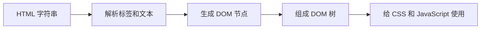

# HTML 基础必备知识

- HTML（HyperText Markup Language，超文本标记语言）负责描述页面的结构。
- 浏览器拿到 HTML 文本后，会把字符串解析成一棵 DOM（Document Object Model，文档对象模型）树。
- DOM 树里的每个节点都是一个对象，后续 CSS（Cascading Style Sheets，层叠样式表）、JavaScript、事件系统都会围绕这些对象工作。



- 最重要的心智模型：
    - HTML 不是用来描述样式的。
    - HTML 是用来描述内容结构和语义的。
    - 样式交给 CSS。
    - 行为交给 JavaScript。

- 常用结构：
    - `header`：页面或区域的头部，比如工具顶部栏。
    - `main`：页面主要内容，一个页面通常只有一个。
    - `section`：一块有主题的内容，比如参数面板。
    - `article`：一段可以独立理解的内容。
    - `nav`：导航。
    - `form`：表单。
    - `button`：按钮。
    - `a`（anchor，锚）：超链接，用 `href` 指定要跳转的地址，比如 `<a href="https://example.com">去示例站</a>`。

- 表单的关键点：
    - `form` 收集输入。
    - `input`、`select`、`textarea` 提供输入控件。
    - `label` 让输入项有明确名字，也能提升可访问性。
    - `name` 是提交数据时的字段名。
    - `required`、`type`、`min`、`max` 等属性可以让浏览器先做一层基础校验。

```html
<label>
  图片名称
  <input name="imageName" required>
</label>
```

- 资源加载的关键点：
    - `link rel="stylesheet"` 加载 CSS。
    - `script` 加载 JavaScript。
    - `img` 加载图片。
    - `defer` 会让脚本等 HTML 解析完成后再执行，适合大多数页面脚本。

```html
<link rel="stylesheet" href="./style.css">
<script src="./app.js" defer></script>
```

- 判断 HTML 写得是否靠谱：
    - 页面结构是否能从标签上直接看懂。
    - 表单控件是否有 `label`。
    - 按钮是否真的用 `button`，链接是否真的用 `a`。
    - 是否少用无意义的 `div` 堆结构。

- 可运行示例：
    - [HTML 表单与资源加载示例](../examples/01-html-form-and-assets/index.html)
