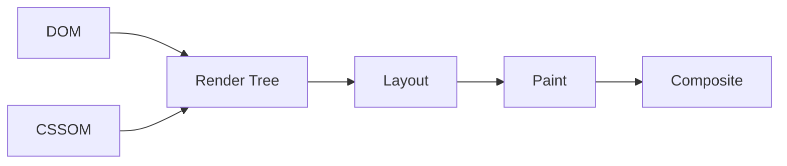

# CSS 基础必备知识

- CSS（Cascading Style Sheets，层叠样式表）负责描述页面长什么样。
- 浏览器会把 CSS 解析成 CSSOM（CSS Object Model，CSS 对象模型），然后结合 DOM（Document Object Model，文档对象模型）计算每个元素的最终样式。
- CSS 的计算结果会继续参与 layout、paint、composite。



- CSS 最重要的几个问题：
    - 选中哪些元素。
    - 这些元素最终应用哪些样式。
    - 这些元素占多大空间。
    - 这些元素排在什么位置。
    - 这些元素之间谁盖住谁。

- 选择器：
    - 类型选择器：`button`。
    - 类选择器：`.toolbar`。
    - 属性选择器：`input[type="range"]`。
    - 状态选择器：`:hover`、`:focus`。

- 层叠和继承：
    - 层叠解决多个规则同时命中时谁生效。
    - 继承解决子元素是否默认拿到父元素的部分样式。
    - 实际开发中优先使用简单类名，减少选择器权重过高导致的维护问题。

- 盒模型：
    - `content` 是内容区域。
    - `padding` 是内容和边框之间的内边距。
    - `border` 是边框。
    - `margin` 是元素外部间距。
    - 推荐全局使用 `box-sizing: border-box`，这样宽高更符合直觉。

```css
* {
  box-sizing: border-box;
}
```

- 布局：
    - Flex 适合一维布局，比如一行工具栏、一列按钮。
    - Grid 适合二维布局，比如面板、卡片网格、复杂页面结构。
    - 绝对定位适合局部浮层、节点编辑器里的节点位置。
- Flex 是 Flexible Box Layout 的简称，核心是沿着一条主轴排列元素。
- Grid 是 CSS Grid Layout 的简称，核心是先划分行和列，再把元素放进格子里。

- 动画：
    - 优先动画 `transform` 和 `opacity`。
    - 避免频繁动画 `width`、`height`、`top`、`left`，这些更容易触发布局计算。

- 判断 CSS 写得是否靠谱：
    - 布局意图是否清楚。
    - 是否减少了魔法数字。
    - 状态样式是否完整，比如 hover、focus、disabled。
    - 是否在移动端和桌面端都不会挤压错位。

- 可运行示例：
    - [CSS 布局与动画示例](../examples/02-css-layout-and-animation/index.html)
