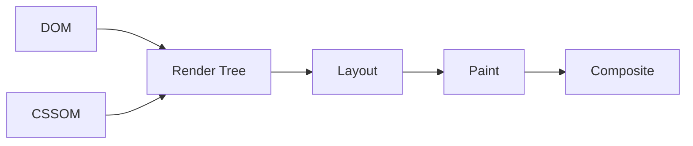

# CSS 基础必备知识

- CSS（Cascading Style Sheets，层叠样式表）负责描述页面长什么样。
- 浏览器会把 CSS 解析成 CSSOM（CSS Object Model，CSS 对象模型），然后结合 DOM（Document Object Model，文档对象模型）计算每个元素的最终样式。
- CSS 的计算结果会继续参与 layout、paint、composite。
    - layout（布局，也叫 reflow/回流）：根据样式计算每个元素的几何信息——大小和位置（谁在哪、多宽多高）。
    - paint（绘制）：把每个元素按样式画成像素，填上颜色、文字、边框、阴影等。
    - composite（合成）：把分层画好的内容按层叠顺序合并成最终一帧，显示到屏幕上（位移、透明度等常可只在这步完成，性能最好）。



- CSS 最重要的几个问题：
    - 选中哪些元素。
    - 这些元素最终应用哪些样式。
    - 这些元素占多大空间。
    - 这些元素排在什么位置。
    - 这些元素之间谁盖住谁。

- 选择器：
    - 类型选择器：`button`。
    - 类选择器：`.toolbar`。
    - 属性选择器：`input[type="range"]`。只选「type 是 range 的 input」，也就是页面上的滑块控件，而不会动到 type="text"、type="checkbox" 等其他 input
    - 状态选择器：`:hover`、`:focus`。

- 层叠和继承：
    - 层叠（Cascading，就是 CSS 里那个 C）指：当多条规则同时命中同一个元素的同一个属性时，浏览器按一套优先级规则（重要性 > 选择器权重/specificity > 书写顺序，靠后者胜出）层层比较，挑出最终生效的那一条。
    - 继承解决子元素是否默认拿到父元素的部分样式。
    - 实际开发中优先使用简单类名，减少选择器权重过高导致的维护问题。

- 盒模型：
    - `content` 是内容区域。
    - `padding` 是内容和边框之间的内边距。
    - `border` 是边框。
    - `margin` 是元素外部间距。
    - 推荐全局使用 `box-sizing: border-box`，这样宽高更符合直觉。
        - `box-sizing` 决定你写的 `width`/`height` 算到哪一层。默认值 `content-box` 只算内容区：写 `width: 100px` 再加 `padding: 20px`、边框 `5px`，实际占地会被撑到 150px，很反直觉。
        - 改成 `border-box` 后，`width: 100px` 就是包含 padding 和 border 的最终宽度，内容区自动收缩适应——你写多宽，肉眼看到的就是多宽，加内边距/边框也不会把布局撑爆。

```css
* {
  box-sizing: border-box;
}
```

- 布局：
    - Flex 适合一维布局，比如一行工具栏、一列按钮。
    - Grid 适合二维布局，比如面板、卡片网格、复杂页面结构。
    - 绝对定位适合局部浮层、节点编辑器里的节点位置。
        - 写法是两步：先给“参照物”（父容器）加 `position: relative`，再给要定位的元素加 `position: absolute`，配合 `top`/`right`/`bottom`/`left` 指定距参照物各边的距离。
        - 绝对定位的元素会脱离正常文档流（不再占位置），它以“最近的设置过 position 的祖先”为参照；如果一个都没有，就会参照整个页面，这往往不是你想要的，所以别忘了给父容器加 `position: relative`。
        - `relative` 意为“相对定位”，它有两个作用：
            - 作用一：让元素相对“自己原来的位置”偏移（配合 `top`/`left` 等）。注意这只是视觉上挪走，原位置仍被保留占用，别的元素不会过来填空。
            - 作用二（固定搭配里的用法）：当绝对定位子元素的“参照物”。CSS 规定 `absolute` 以“最近的 `position` 值不是 `static` 的祖先”为参照（`static` 是所有元素的默认值，意为“不定位”）。
            - `static` 元素的位置怎么定：完全由“正常文档流”决定——浏览器按 HTML 书写顺序，结合父容器的布局方式（块级从上往下叠、行内从左往右排，或 flex/grid 的排布规则）自动排出位置，`top`/`left`/`z-index` 对它一律无效。
        - 为什么参照物偏偏选 `relative`，而不是别的 position 值：因为它副作用最小。`absolute` 会让父容器自己也脱离文档流，`fixed` 会把它钉死在视口上——都会改变父容器自身的布局行为。只有 `relative` 在不写偏移时元素一动不动，占的空间也完全一样，等于“零成本”地声明“我来当参照物”。
        - 唯一的小副作用：设置了 `position` 的元素会参与层叠（可配合 `z-index` 控制谁压住谁），在浮层场景里这通常正是想要的。

```css
.panel {
  position: relative; /* 作为定位参照物；不写偏移时自身布局完全不变 */

  /* 如果加上偏移，.panel 会相对“自己原来的位置”移动，
     但原位置仍被占用，周围元素不会重新排布：
  top: 10px;   往下挪 10px
  left: 20px;  往右挪 20px */
}

/* 两个选择器用空格隔开叫“后代选择器”：匹配 .panel 内部（任意层级）的 .close-button（只要内部就行、不一定需要是直系子层级），
   面板外面的 .close-button 不受影响。 
   顺带区分一个容易混的写法：.panel.close-button（没有空格）意思完全不同——它匹配「同时带有 panel 和 close-button 两个 class 的同一个元素」。空格有无，差别很大。
*/
.panel .close-button {
  position: absolute; /* 脱离文档流，相对最近的定位祖先（这里是 .panel）定位 */
  top: 8px;           /* 距 .panel 顶部 8px */
  right: 8px;         /* 距 .panel 右侧 8px */
}

/* 反例：如果 .panel 没写 position: relative，
   .close-button 会一路向上找不到定位祖先，最终参照整个页面，
   跑到页面右上角而不是面板右上角。 */
```

- Flex 是 Flexible Box Layout 的简称，核心是沿着一条主轴排列元素。
- Grid 是 CSS Grid Layout 的简称，核心是先划分行和列，再把元素放进格子里。

- 动画：
    - 优先动画 `transform` 和 `opacity`。
    - 避免频繁动画 `width`、`height`、`top`、`left`，这些更容易触发布局计算。
    - 为什么 `transform` 不触发重新布局（layout）：
        - 浏览器对 `transform` 的处理很特殊：元素在文档流里的位置和占的空间完全不变——layout 眼里它根本没动。`transform: translateX(100px)` 只是在最后的 composite（合成）阶段，把已经画好的那张“图层”整体平移 100px 再合成上去。
        - 所以它不触发 layout（几何信息没变，周围元素不会被挤动），通常也不触发 paint（像素早画好了，只是挪图层），只走 composite——而这步常由 GPU 完成，可以不阻塞主线程，因此动画最流畅。
        - `opacity` 同理：透明度也是在合成阶段直接调整图层的。
    - 注意 `transform` 不等于 `position`，两者是不同的东西：
        - 改 `top`/`left`（配合 position 定位）：改的是真实的几何位置，每一帧都要重新 layout，还会牵连周围元素，动画容易卡。
        - 改 `transform: translate(...)`：真实位置不动，只在合成时做视觉偏移。视觉效果一样，成本却差一个数量级。
    - 直观类比：layout 像重新排版整本书，而 `transform` 像把已经印好的一页纸整体挪个位置——书的排版完全没动。

- 判断 CSS 写得是否靠谱：
    - 布局意图是否清楚。
    - 是否减少了魔法数字。
        - 魔法数字（magic number）指来历不明、只是“调到看起来对”的硬编码数值。比如 `margin-top: 37px`——为什么是 37？因为正好对齐了旁边 36px 高的按钮加 1px 边框。一旦按钮改高，37 就悄悄失效，而且没人知道它当初怎么来的。
        - 更好的写法是让数值“有出处”：用布局自动对齐（flex 的 `align-items: center`）、用变量（`var(--button-height)`，CSS 自定义属性的语法——以 `--` 开头的名字是自己定义的变量，如先声明 `--button-height: 36px;`，再用 `var(...)` 在任何地方取出这个值，改一处全局生效）或写 `calc()` 把计算过程留在代码里。
    - 状态样式是否完整，比如 hover、focus、disabled。
    - 是否在移动端和桌面端都不会挤压错位。

- 可运行示例：
    - [CSS 布局与动画示例](../examples/02-css-layout-and-animation/index.html)
    - ↑、响应式排版布局（比如不同分辨率下的排版规则自动切换），可以用css配置出来；transform keyframe动画，也可以用css配置出来
