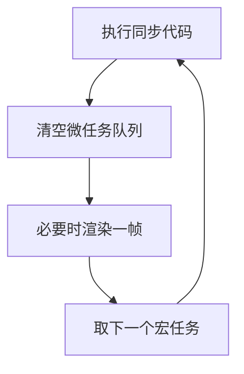

# JavaScript / TypeScript 基础必备知识

- JavaScript 负责页面行为。
- 浏览器里的 JavaScript 可以读写 DOM（Document Object Model，文档对象模型）、监听事件、发起网络请求、处理异步任务。
- TypeScript 是 JavaScript 的类型增强版本，会在开发和构建阶段做类型检查，帮助你在运行前发现一部分错误。

- JavaScript 的几个核心模型：
    - 值：数字、字符串、布尔值、对象、数组、函数。
    - 引用：对象和数组通常通过引用传递。
    - 函数：函数是一等值，可以传递、保存、返回。
    - 闭包：函数能记住创建它时所在作用域里的变量。
    - 原型：对象可以通过原型链查找属性。
    - 模块：一个文件可以导入和导出变量、函数、类。

- 事件循环：
    - 同步代码先执行。
    - Promise 回调进入微任务队列。
    - `setTimeout` 回调进入宏任务队列。
    - 一轮同步代码结束后，浏览器先清空微任务，再取下一个宏任务。



```js
console.log("sync 1");

Promise.resolve().then(() => {
  console.log("micro task");
});

setTimeout(() => {
  console.log("macro task");
}, 0);

console.log("sync 2");
```

- 输出顺序：
    - `sync 1`
    - `sync 2`
    - `micro task`
    - `macro task`

- TypeScript 的关键点：
    - 类型只在开发和构建阶段生效。
    - 浏览器最终运行的仍然是 JavaScript。
    - 类型不是为了写得复杂，而是为了把数据结构和函数边界说清楚。

```ts
type FilterNode = {
  id: string;
  type: "input" | "grayscale" | "output";
  params: Record<string, number | string>;
};

function updateNode(nodes: FilterNode[], nextNode: FilterNode) {
  return nodes.map((node) => node.id === nextNode.id ? nextNode : node);
}
```

- 判断 JavaScript / TypeScript 写得是否靠谱：
    - 数据结构是否清楚。
    - 异步流程是否可读。
    - 错误是否被处理。
    - 函数是否只做一件明确的事。
    - TypeScript 类型是否表达业务边界，而不是到处使用 `any`。

- 可运行示例：
    - [JavaScript 事件循环与 DOM 示例](../examples/03-js-event-loop-and-dom/index.html)
