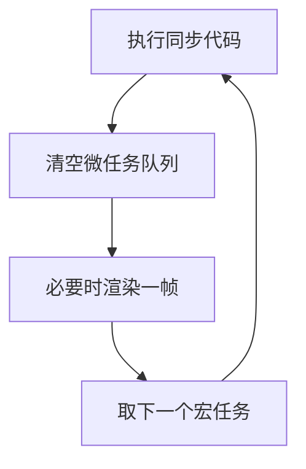

# JavaScript / TypeScript 基础必备知识

- JavaScript 负责页面行为。
- 浏览器里的 JavaScript 可以读写 DOM（Document Object Model，文档对象模型）、监听事件、发起网络请求、处理异步任务。
- TypeScript 是 JavaScript 的类型增强版本，会在开发和构建阶段做类型检查，帮助你在运行前发现一部分错误。

- JavaScript 的几个核心模型：
    - 值：数字、字符串、布尔值、对象、数组、函数。
    - 引用：对象和数组通常通过引用传递。
    - 函数：函数是一等值，可以传递、保存、返回。
    - 闭包：函数能记住创建它时所在作用域里的变量。
    - 原型：对象可以通过原型链查找属性。
    - 模块：一个文件可以导入和导出变量、函数、类。

- 事件循环：
    - 同步代码先执行。
    - Promise 回调进入微任务队列。
    - `setTimeout` 回调进入宏任务队列。
    - 一轮同步代码结束后，浏览器先清空微任务，再取下一个宏任务。

- 通俗理解「微任务」和「宏任务」：
    - 背景：JavaScript 一次只能做一件事（单线程），所以"等会儿再做的事"都要排队。队列有两条，优先级不同。
    - 微任务（microtask）：「手头这件事一做完，马上顺手处理掉」的事。来源主要是 Promise 的 `.then` / `catch` / `finally`、`await` 后面的代码、`queueMicrotask`。
    - 宏任务（macrotask）：「下一轮再说」的事。来源主要是 `setTimeout` / `setInterval`、用户点击等事件回调、网络请求完成的回调。
    - 打个比方：你在柜台办业务（同步代码），办完后柜员先把你这单的「附带小事」全部处理完（清空微任务，比如盖章、装订），才喊「下一位」（取下一个宏任务）。新来的客人即使排得再早，也得等当前这单的小事全部办完。
    - 所以 `setTimeout(fn, 0)` 不是"立刻执行"，而是"排到下一轮"；而 Promise 回调插在本轮末尾，总是比它先跑——这就是下面例子里 `micro task` 先于 `macro task` 输出的原因。
    - 关键规则：每轮循环里，微任务队列会被一次性清空（包括清空过程中新产生的微任务），宏任务则一轮只取一个。
- 举例
  - 我自己用 node 执行一个js文件，如果这个js文件里就是一些顺序执行且立即执行的计算，那就只有一个宏任务
  - 浏览器的情况：
    - 主线程跑一个**永不退出**的循环：取一个宏任务跑完 → 清空微任务 → 到渲染时机且页面有变化就画一帧 → 重复。
    - 最初执行 `<script>` 代码就是第一个宏任务；之后的宏任务来自用户点击等事件回调、`setTimeout` 到期回调、网络响应回调等。
    - 和 Node 不同，队列空了进程不会结束：主线程闲着等，用户一操作，新宏任务入队，循环立刻接着转。所以浏览器是**事件驱动**的——有事就做，没事就等。
    - 宏任务和渲染不是一一对应：渲染约每 16.7ms 才有一次机会（屏幕刷新率），任务快时一帧间隔里可能连跑多个宏任务；反过来一个慢宏任务（如长时间同步计算）会堵住渲染，页面就卡顿掉帧。
    - 一句话：脚本初始执行、用户操作、定时器、网络回调全排进同一条队列，一次只跑一个，谁慢谁就堵住所有人（包括渲染）。



```js
console.log("sync 1");

// Promise.resolve() 创建一个“已经成功”的 Promise；
// .then(回调) 注册“成功后要做的事”。注意：即使 Promise 已经是成功状态，
// 回调也不会立刻执行，而是被放进微任务队列，等当前同步代码全部跑完才执行。
// 这是规范刻意设计的：.then 回调永远是异步的，保证执行顺序可预测。
Promise.resolve().then(() => {
  console.log("micro task");
});

setTimeout(() => {
  console.log("macro task");
}, 0);

console.log("sync 2");
```

- 输出顺序：
    - `sync 1`
    - `sync 2`
    - `micro task`
    - `macro task`

- TypeScript 的关键点：
    - 类型只在开发和构建阶段生效。
    - 浏览器最终运行的仍然是 JavaScript。
    - 类型不是为了写得复杂，而是为了把数据结构和函数边界说清楚。

```ts
type FilterNode = {
  id: string;
  // 字面量联合类型：| 表示“或”，type 字段的值只能是这三个字符串之一。
  // 写成 string 也能跑，但收窄成三个字面量后，拼错（如 "grayscle"）
  // 或传入未支持的值，编译阶段就会报错，而不是运行时才发现。
  type: "input" | "grayscale" | "output";
  // Record<K, V> 表示“键是 K 类型、值是 V 类型的对象”。
  // 这里即：键是任意字符串、值是数字或字符串的对象，
  // 比如 { radius: 4, mode: "fast" }。适合键名不固定、但值类型可控的场景。
  params: Record<string, number | string>;
};

function updateNode(nodes: FilterNode[], nextNode: FilterNode) {
  // 三件事拆开看：
  // 1. map：遍历数组，对每个元素调用回调，用返回值组装出一个新数组（不改原数组）。
  // 2. 箭头函数 (node) => ...：回调的简写，省略了 function 和 return。
  // 3. 三元表达式 a ? b : c：“条件 ? 成立取这个 : 不成立取那个”。
  // 合起来：id 和 nextNode 相同的那一项换成 nextNode，其余原样保留。
  // 效果是“替换数组中的一项”，但返回的是新数组而不是原地修改——
  // 这种“不可变更新”风格在 React 等框架中是惯例：框架靠比较新旧数组
  // 的引用是否变化来判断要不要重新渲染。
  // 不可变更新：不改原来的数据，而是造一份"改好了的新副本"来替换它——旧的保持原样，新的整体换上，这样只看引用变没变就知道数据动没动过
  return nodes.map((node) => node.id === nextNode.id ? nextNode : node);
}
```

- 判断 JavaScript / TypeScript 写得是否靠谱：
    - 数据结构是否清楚。
    - 异步流程是否可读。
    - 错误是否被处理。
    - 函数是否只做一件明确的事。
    - TypeScript 类型是否表达业务边界，而不是到处使用 `any`。

- 可运行示例：
    - [JavaScript 事件循环与 DOM 示例](../examples/03-js-event-loop-and-dom/index.html)
