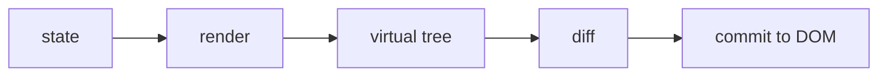

# React 基础必备知识

- React 的核心思想是：UI（User Interface，用户界面）是 state 的结果。
- 你不直接手动改一堆 DOM（Document Object Model，文档对象模型），而是描述当前状态下页面应该长什么样。
- state 变化后，React 重新计算 UI，再把必要的变化提交到真实 DOM。



- 组件：
    - 组件就是“一块自带逻辑的 UI 积木”，比如一个按钮、一个卡片、一个面板。页面就是积木拼出来的，同一块积木可以到处复用。
    - 写出来就是一个函数：吃进数据，吐出界面长什么样的描述。
    - props 是“别人递给它的数据”：父组件传进来，组件自己只能读不能改。好比函数的参数。
    - state 是“它自己记住的数据”：比如输入框里打了什么字、开关是开还是关。组件自己改，改了之后 React 会自动重新画这块积木。
    - 一句话区分：props 来自外面、自己改不了；state 属于自己、自己说了算。

- hooks：
    - 函数组件本身只是个普通函数，跑完就什么都不剩。hooks 就是 React 给函数“外挂”的一组能力，让它能记住数据、能在渲染后干活。名字都以 use 开头。
    - 最常用的五个：
        - `useState`：给组件加一块“记忆”。返回当前值和一个改值的函数，调用改值函数就会触发重新渲染。
        - `useEffect`：“渲染完成之后，再去干这件事”——比如发请求、挂事件监听、起定时器。
        - `useMemo`：“这个计算很贵，依赖没变就别重算了，用上次的结果。”
        - `useCallback`：“这个函数别每次渲染都重新建一个，依赖没变就复用旧的。”常用于把函数往子组件传时避免子组件白白重渲染。
        - `useRef`：一个“随便存东西的盒子”，改它不会触发重新渲染。最常见的用途是拿到真实 DOM 节点。

- 副作用：
    - 组件函数的本职工作是“根据数据算出界面”，这一步应该是纯计算：同样的输入永远得到同样的输出，不碰外面的世界。
    - 凡是“碰了外面世界”的事都叫副作用：发网络请求、监听窗口事件、开定时器、手动改 DOM。
    - 这些事不能在渲染过程中做（渲染可能反复执行），要放进 `useEffect`，等渲染完成后再做。
    - 做了就要善后：组件销毁或重新执行 effect 前，把监听器拆掉、定时器清掉（在 effect 里 return 一个清理函数）。不清理的后果：监听器越挂越多、内存泄漏、旧请求把新数据覆盖。

```js
React.useEffect(() => {
  const onResize = () => console.log(window.innerWidth);
  window.addEventListener("resize", onResize);

  return () => {
    window.removeEventListener("resize", onResize);
  };
}, []);
```

- effect 的执行时机由第二个参数（依赖数组）决定，共三种写法：

```js
// 写法 1：不传第二个参数 —— 每次渲染完都执行。
// 清理函数：下一次渲染完、重新执行 effect 之前，先执行上一次的清理函数，
// 即每一轮都是“先拆上一轮的，再装这一轮的”；组件销毁时再拆最后一轮的。
// 最容易写出性能问题，少用。
useEffect(() => {
  ...
  return () => { ... };
});

// 写法 2：空数组 [] —— 只在挂载完成后执行一次（上面 resize 的例子就是这种）。
// 清理函数：只在组件销毁时执行一次。
// 整个生命周期就两件事：挂载后装一次，销毁时拆一次。
useEffect(() => {
  ...
  return () => { ... };
}, []);

// 写法 3：有依赖 [a, b] —— 挂载后执行一次；之后只有 a 或 b 变了，
// 才在那次渲染完成后再执行。
// 清理函数：依赖变化触发新 effect 之前，先执行上一次的清理函数（先拆旧的再装新的，
// 保证任何时刻最多只有一套副作用在生效）；组件销毁时再拆最后一套。
// 写法 2 其实是写法 3 的特例：依赖为空、永远不变，所以只装一次、拆一次。
useEffect(() => {
  ...
  return () => { ... };
}, [a, b]);
```

- 状态归属：
    - 谁需要读这个状态，状态就应该放在这些组件共同的最近父级。
    - 只有一个组件用到的状态，不要过早放到全局。
    - 从 props 或其他 state 能算出来的数据，优先计算，不要额外存一份。

- 判断 React 代码是否靠谱：
    - 组件职责是否清楚。
    - state 是否放在合理位置。
    - effect 是否有明确原因和清理逻辑。
    - 列表是否有稳定 key。
    - 是否避免把复杂业务逻辑塞进 JSX（JavaScript XML，一种在 JavaScript 里写 UI 结构的语法）。

- 可运行示例：
    - [React state 与 effect 示例](../examples/08-react-state-cdn/index.html)
    - 这个示例使用 CDN（Content Delivery Network，内容分发网络）版本 React，浏览器需要能访问外部 CDN。
