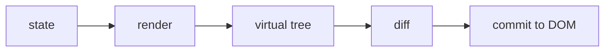

# React 基础必备知识

- React 的核心思想是：UI（User Interface，用户界面）是 state 的结果。
- 你不直接手动改一堆 DOM（Document Object Model，文档对象模型），而是描述当前状态下页面应该长什么样。
- state 变化后，React 重新计算 UI，再把必要的变化提交到真实 DOM。



- 组件：
    - 组件是可复用的 UI 单元。
    - 组件输入是 props，props 可以理解成父组件传进来的参数。
    - 组件内部可变数据是 state，state 可以理解成组件自己的记忆。
    - 组件返回当前状态下的 UI 描述。

- hooks：
    - hooks 是 React 提供的一组函数，让函数组件也能使用状态、副作用、缓存和 DOM 引用。
    - `useState` 保存组件状态。
    - `useEffect` 处理渲染之后的副作用，比如订阅、请求、定时器。
    - `useMemo` 缓存计算结果。
    - `useCallback` 缓存函数引用。
    - `useRef` 保存不触发渲染的可变引用，也能拿 DOM 节点。

- 副作用：
    - 渲染阶段应该尽量是纯计算。
    - 网络请求、事件监听、定时器、手动 DOM 操作都属于副作用。
    - 副作用要清理，否则容易产生重复监听、内存泄漏和状态错乱。

```js
React.useEffect(() => {
  const onResize = () => console.log(window.innerWidth);
  window.addEventListener("resize", onResize);

  return () => {
    window.removeEventListener("resize", onResize);
  };
}, []);
```

- 状态归属：
    - 谁需要读这个状态，状态就应该放在这些组件共同的最近父级。
    - 只有一个组件用到的状态，不要过早放到全局。
    - 从 props 或其他 state 能算出来的数据，优先计算，不要额外存一份。

- 判断 React 代码是否靠谱：
    - 组件职责是否清楚。
    - state 是否放在合理位置。
    - effect 是否有明确原因和清理逻辑。
    - 列表是否有稳定 key。
    - 是否避免把复杂业务逻辑塞进 JSX（JavaScript XML，一种在 JavaScript 里写 UI 结构的语法）。

- 可运行示例：
    - [React state 与 effect 示例](../examples/08-react-state-cdn/index.html)
    - 这个示例使用 CDN（Content Delivery Network，内容分发网络）版本 React，浏览器需要能访问外部 CDN。
