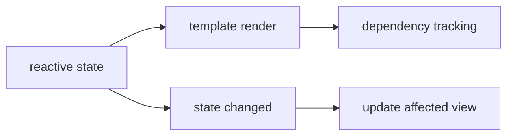

# Vue 基础必备知识

- Vue 的核心思想也是：UI 是状态的结果。
- Vue 更强调模板和响应式数据。
- 当响应式数据变化时，Vue 会找到依赖这些数据的视图并更新。



- 模板：
    - 模板描述 UI 结构。
    - `{{ value }}` 显示数据。
    - `v-if` 控制是否渲染。
    - `v-for` 渲染列表。
    - `v-model` 处理表单双向绑定。
    - `@click` 监听点击事件。

- 响应式：
    - Vue 会把对象包装成响应式对象。
    - 渲染时读取了哪些字段，Vue 会记录依赖。
    - 字段变化时，只更新受影响的部分。

- computed 和 watch：
    - `computed` 适合从已有状态计算新值。
    - `watch` 适合在某个状态变化后执行副作用。

```js
const total = Vue.computed(() => items.value.length);

Vue.watch(total, (next) => {
  console.log("total changed", next);
});
```

- 判断 Vue 代码是否靠谱：
    - 模板是否清晰表达结构。
    - computed 是否替代了不必要的重复 state。
    - watch 是否只处理必要副作用。
    - 组件之间的数据流是否明确。
    - 是否避免在模板里写过重逻辑。

- 可运行示例：
    - [Vue 响应式与 computed 示例](../examples/09-vue-reactivity-cdn/index.html)
    - 这个示例使用 CDN 版本 Vue，浏览器需要能访问外部 CDN。
