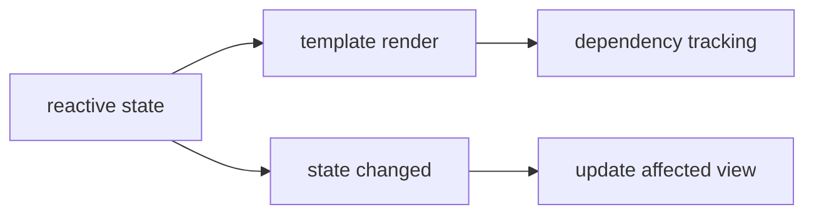

# Vue 基础必备知识

- Vue 的核心思想也是：UI（User Interface，用户界面）是状态的结果。
- Vue 更强调模板和响应式数据。
- 当响应式数据变化时，Vue 会找到依赖这些数据的视图并更新。


```mermaid
flowchart LR
    A["reactive state"] --> B["template render"]
    B --> C["dependency tracking"]
    A --> D["state changed"]
    D --> E["update affected view"]
```

- 图里两个关键环节：
    - template render（模板渲染）：模板是你写的“页面长什么样”的 HTML 描述，里面夹着数据占位符（如 `{{ strength }}`）。渲染就是把占位符替换成真实数据、生成真正页面的过程——好比模板是带空格的填空题，render 就是把空填上变成真实页面。
    - dependency tracking（依赖追踪）：render 过程中，Vue 会偷偷记下“这次渲染用到了哪些数据”，建立一张“哪块视图依赖哪个数据”的关系表。这样等数据变化时（图中 state changed），Vue 查表就知道只有哪块视图受影响，于是只更新它、其它不动（update affected view），不做无用功。
    - 打个比方：依赖追踪像图书馆登记“谁借了哪本书”，某本书要更新时只通知借了它的读者，而不是群发给所有人。

- 模板：
    - 模板描述 UI 结构。
    - `{{ value }}` 显示数据。
    - `v-if` 控制是否渲染。
    - `v-for` 渲染列表。
    - `v-model` 处理表单双向绑定。
        - 通俗说就是“让输入框和数据绑在一起、自动同步”，不用自己写搬运代码：
            - 数据 → 界面：数据一变，输入框显示的内容跟着变；
            - 界面 → 数据：用户打字，数据的值也跟着变。
        - 没有 `v-model` 时这两件事得手动做（数据变了塞回输入框、监听输入事件存回数据），`v-model` 把它们自动都做了，所以叫“双向”。
        - 打个比方：输入框和数据像一根绳子拴着的两端，动任意一端，另一端立刻跟着动。
    - `@click` 监听点击事件。
    - 一个小例子把这些放一起看（假设 state 有 `newTodo` 字符串和 `todos` 数组）：

```vue
<template>
  <!-- v-model：输入框和 newTodo 双向绑定，输入框改 → newTodo 变，反之亦然 -->
  <input v-model="newTodo" placeholder="输入待办">

  <!-- @click：点击时调用 addTodo 方法（@click 是 v-on:click 的简写） -->
  <button @click="addTodo">添加</button>

  <!-- v-if：todos 为空时才渲染这行提示，不为空则这段根本不出现在页面上 -->
  <p v-if="todos.length === 0">还没有待办</p>

  <!-- v-for：遍历 todos，每项渲染一个 li；:key 给每项一个稳定标识，帮 Vue 高效更新列表 -->
  <ul>
    <li v-for="todo in todos" :key="todo.id">
      <!-- {{ }}：把数据插到文本里显示出来 -->
      {{ todo.text }}
    </li>
  </ul>
</template>
```

    - 串起来：`v-model` 收集输入 → `@click` 触发添加 → 数据变了，依赖 `todos` 的 `v-if` 和 `v-for` 自动重新渲染 → `{{ }}` 显示出每条文本。整个过程你只改数据，DOM 更新交给 Vue。

- 响应式：
    - Vue 会把对象包装成响应式对象。
    - 渲染时读取了哪些字段，Vue 会记录依赖。
    - 字段变化时，只更新受影响的部分。

- computed 和 watch：
    - `computed` 适合从已有状态计算新值。
    - `watch` 适合在某个状态变化后执行副作用。

```js
// computed：基于已有响应式数据“算出”一个新值。这里 total 永远等于 items 的长度。
// 它是惰性 + 缓存的：只有 items 变了才重新计算，否则反复读取 total 直接返回上次结果。
// .value：在 JS 里读写 ref/computed 的值要加 .value（模板里则不用，Vue 自动解包）。
const total = Vue.computed(() => items.value.length);

// watch：盯住某个响应式数据，它一变化就执行回调（用来做“副作用”，如打印日志、发请求）。
// 第一个参数是要监听的源（这里是 total），回调的 next 是它变化后的新值。
// 与 computed 的区别：computed 是“算出一个新值给别处用”，watch 是“变化后去做一件事”，不产生新值。
Vue.watch(total, (next) => {
  console.log("total changed", next);
});
```

- 判断 Vue 代码是否靠谱：
    - 模板是否清晰表达结构。
    - computed 是否替代了不必要的重复 state。
    - watch 是否只处理必要副作用。
    - 组件之间的数据流是否明确。
    - 是否避免在模板里写过重逻辑。

- 可运行示例：
    - [Vue 响应式与 computed 示例](../examples/09-vue-reactivity-cdn/index.html)
    - 这个示例使用 CDN（Content Delivery Network，内容分发网络）版本 Vue，浏览器需要能访问外部 CDN。

# 关于公共CDN

- 像 unpkg、cdnjs、jsDelivr 这类面向开源的公共 CDN，看起来免费，但并不是靠收使用费赚钱，主要靠下面几种方式维持：

- 背后有商业 CDN 公司免费赞助（最主要）：
    - 这些服务自己不买带宽，而是由商业 CDN 厂商免费提供基础设施。例如 unpkg 主要由 Cloudflare 支持，jsDelivr 由 Cloudflare、Fastly、Bunny 等联合赞助。
    - 对厂商来说，赞助知名开源项目是极佳的品牌广告：几乎每个前端开发者都见过 `unpkg.com`、`cdnjs.cloudflare.com` 这些域名，相当于天天在程序员面前曝光，比买广告划算。

- 成本其实没那么高：
    - 静态文件（JS/CSS）高度可缓存：同一个 `vue@3` 文件全球请求的内容完全相同，边缘节点缓存一次就能服务海量请求，回源成本极低。
    - 对已经铺好全球网络的厂商，多承载这点开源流量的边际成本几乎为零。

- 免费版引流 → 付费版变现：
    - 把公共服务当漏斗入口，开发者免费用得顺手，等公司项目需要 SLA 保障、私有部署、更高带宽时，自然会买它们的付费企业版。

- 公益 / 基金会 / 个人维护：
    - 部分服务靠 GitHub Sponsors、Open Collective 等捐赠，或挂靠非营利基金会运营。unpkg 最初就是开发者 Michael Jackson（React Router 作者）个人发起的项目。

- 一句话总结：你免费，是因为有商业 CDN 把它当广告位和引流入口在埋单。
    - 代价是它没有可用性承诺，可能限速、宕机或被墙，所以正式生产环境一般不直接依赖公共 CDN，而是用自己购买的商业 CDN 或自托管。这也是上面示例标注“浏览器需要能访问外部 CDN”的原因。

# vue 和 react 怎么选型

- 先说结论（结合你的场景）：优先 React。理由不是 React 一定更好，而是它最贴合你的实际处境。

- 通用对比（先有个底）：
    - React：生态最大、招人最容易、TypeScript 支持最成熟、复杂逻辑表达灵活，适合大型/长期维护项目。
    - Vue：上手平缓、模板语法直观、样板代码少、响应式自动更新，适合中小项目和快速开发。
    - 两者都能做你要的事，差距没有想象中大，选型更多看「团队和环境」而非框架本身优劣。

- 结合你的工作场景，为什么倾向 React：
    - 跟随公司技术栈：Canva 前端主要是 React，内部组件库、工具链、设计系统都围绕 React。选 React 能直接复用这些，协作和求助成本最低——这一条权重最高。
    - 复杂可视化编辑器：你要做类 ComfyUI 的节点编排、特效工具，属于逻辑密集型应用。这类场景成熟方案多在 React 生态，比如 React Flow（@xyflow/react）直接提供节点、连线、缩放平移，省掉大量自研。
    - native 引擎 / WASM 接入：把渲染引擎挂到 canvas、管理 GL 上下文、和 WASM 通信，这些是「命令式、要精确控制时机」的活。React 用 ref + useEffect 管理这种「框架之外的对象」很常见、范式清晰；Vue 也能做，但 React 社区这类案例和文档更多。
    - AI 辅助开发更可控：React 训练语料和社区示例最多，AI 生成的代码质量和可参考性更高，正好契合你「让 AI 在手里可控」的目标。

- 什么情况下反而选 Vue：
    - 团队已经在用 Vue，或你个人已熟悉 Vue——别为了「更主流」而切换，迁移成本通常不划算。
    - 纯粹做中小型工具、追求快速出活，且没有上面那些复杂可视化/引擎接入需求。

- 一句话：框架优劣是次要的，「跟随公司/团队既有技术栈」才是第一原则。在 Canva 做这两个项目，选 React 几乎是确定答案。