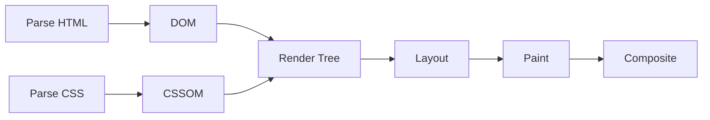

# 浏览器渲染与性能

- 浏览器渲染页面不是一步完成的。
- 它会解析 HTML（HyperText Markup Language，超文本标记语言）、解析 CSS（Cascading Style Sheets，层叠样式表）、计算布局、绘制像素、合成图层。
- 性能问题通常来自主线程工作太重、布局计算太频繁、绘制面积太大、图片和脚本加载太慢。



- layout：
    - layout 是布局计算，负责算出每个元素的位置和尺寸。
    - 修改会影响尺寸和位置的属性，通常会触发 layout。
    - 比如 `width`、`height`、`padding`、`font-size`、`top`。

- paint：
    - paint 是绘制，负责把文字、背景、边框、阴影等画成像素。
    - 修改颜色、阴影、背景等属性，通常会触发 paint。

- composite：
    - composite 是合成，负责把不同图层合成到屏幕上。
    - `transform` 和 `opacity` 通常可以只走 composite，成本更低。

- layout thrashing：
    - layout thrashing 可以理解成「布局抖动」：一边读布局，一边写布局，会迫使浏览器反复提前计算。
    - 常见读操作：`getBoundingClientRect()`、`offsetWidth`、`clientHeight`。
    - 常见写操作：修改 `style.width`、`style.left`、添加 class。
    - 更好的方式是先批量读，再批量写。

```js
// 不推荐：读写交错，容易反复触发布局计算
items.forEach((item) => {
  const width = item.offsetWidth;
  item.style.width = `${width + 10}px`;
});

// 推荐：先读，后写
const widths = items.map((item) => item.offsetWidth);
items.forEach((item, index) => {
  item.style.width = `${widths[index] + 10}px`;
});
```

- requestAnimationFrame：
    - requestAnimationFrame 是浏览器提供的动画调度函数，适合把视觉更新安排到下一帧。
    - 常用于动画、拖拽、滚动同步。

- DevTools Performance 面板：
    - 看主线程是否有长任务。
    - 看一帧里 layout、paint、script 各自花了多久。
    - 看 FPS（Frames Per Second，每秒帧数）是否稳定。
    - 对编辑器类应用，重点看拖拽和缩放时是否频繁全量重渲染。

- 可运行示例：
    - [浏览器渲染与性能示例](../examples/04-browser-rendering-performance/index.html)
