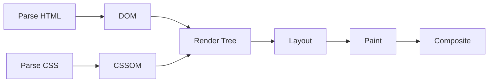

# 浏览器渲染与性能

- 浏览器渲染页面不是一步完成的。
- 它会解析 HTML（HyperText Markup Language，超文本标记语言）、解析 CSS（Cascading Style Sheets，层叠样式表）、计算布局、绘制像素、合成图层。
- 性能问题通常来自主线程工作太重、布局计算太频繁、绘制面积太大、图片和脚本加载太慢。


```mermaid
flowchart LR
    A["Parse HTML"] --> B["DOM"]
    C["Parse CSS"] --> D["CSSOM"]
    B --> E["Render Tree"]
    D --> E
    E --> F["Layout"]
    F --> G["Paint"]
    G --> H["Composite"]
```

## layout

- layout 是布局计算，负责算出每个元素的位置和尺寸。
- 修改会影响尺寸和位置的属性，通常会触发 layout。
- 比如 `width`、`height`、`padding`、`font-size`、`top`。

## paint

- paint 是绘制，负责把文字、背景、边框、阴影等画成像素。
- 修改颜色、阴影、背景等属性，通常会触发 paint。

## composite

- composite 是合成，负责把不同图层合成到屏幕上。
- `transform` 和 `opacity` 通常可以只走 composite，成本更低。

## layout thrashing

- layout thrashing 可以理解成「布局抖动」：一边读布局，一边写布局，会迫使浏览器反复提前计算。
- 常见读操作：`getBoundingClientRect()`、`offsetWidth`、`clientHeight`。
- 常见写操作：修改 `style.width`、`style.left`、添加 class。
- 更好的方式是先批量读，再批量写。

```js
// 不推荐：读写交错，容易反复触发布局计算
items.forEach((item) => {
  // offsetWidth：元素在页面上实际占的宽度（整数像素），包含 content + padding + border，但不含 margin。
  // 读它时浏览器需要先算好布局，所以读完马上写样式会触发重新计算（layout thrashing）。
  const width = item.offsetWidth;
  item.style.width = `${width + 10}px`;
});

// 推荐：先读，后写
const widths = items.map((item) => item.offsetWidth);
items.forEach((item, index) => {
  item.style.width = `${widths[index] + 10}px`;
});
```

## requestAnimationFrame

- requestAnimationFrame 是浏览器提供的动画调度函数，适合把视觉更新安排到下一帧。
- 常用于动画、拖拽、滚动同步。

```js
// 让一个方块平滑地向右移动
const box = document.querySelector('.box');
let left = 0;

function step() {
  left += 2;
  // 用 transform 移动而不是改 left/top：transform 只走 composite（合成）阶段，
  // 不触发 layout 和 paint，浏览器还能交给 GPU 处理，所以动画更省、更顺。
  box.style.transform = `translateX(${left}px)`;
  if (left < 300) {
    // 没到终点就预约下一帧，浏览器会在下次重绘前（约 16.7ms 后）调用 step
    requestAnimationFrame(step);
  }
}

// 启动：第一帧也交给浏览器调度，保证和屏幕刷新节奏对齐
requestAnimationFrame(step);
```

> 什么是「刷新节奏对齐」？
> 屏幕不是连续显示的，而是每秒固定刷新很多次（常见 60 次，即 60Hz，约每 16.7ms 画一次）。
> 浏览器也只在每次刷新前才重绘画面。requestAnimationFrame 会把你的更新「卡」在每次重绘前那一刻执行，
> 一帧只动一次，刚好跟上屏幕节奏——这就是「对齐」。
> 如果用 setInterval 自己定时（比如 10ms 一次），就可能在一帧内算了好几次（白算）或错过某一帧（卡顿），
> 跟屏幕节奏对不上，动画就会忽快忽慢、不顺滑。

## DevTools Performance 面板

- 看主线程是否有长任务。
- 看一帧里 layout、paint、script 各自花了多久。
- 看 FPS（Frames Per Second，每秒帧数）是否稳定。
- 对编辑器类应用，重点看拖拽和缩放时是否频繁全量重渲染。

## 怎么用（以 Microsoft Edge 为例，Chrome 基本一样）

1. 打开开发者工具：按 `F12`，或右键页面选「检查 / Inspect」。
2. 切到顶部的 **Performance（性能）** 标签页。
3. 点左上角的圆形 **Record（录制）** 按钮开始录制，然后在页面上做你想分析的操作（比如拖拽、缩放、滚动）。
4. 操作完点 **Stop（停止）**，等它生成报告。
5. 看报告：
    - **FPS 条**（顶部绿条）：越高越好，掉到红色说明卡顿。
    - **Main（主线程）**：一格格的「火焰图」，横条越长的任务越耗时；红色三角标记的是 **Long Task（长任务，>50ms）**。
    - 点某个任务，下方 **Summary** 会显示它属于哪一类：Scripting（JS，黄色）、Rendering（layout，紫色）、Painting（paint，绿色）。
6. 排查思路：先找最长的横条 → 看它是 JS 还是布局/绘制 → 点进去定位到具体函数或元素，再针对性优化。

> 小技巧：录制前在面板里勾选 **Screenshots（截图）** 可以逐帧回看画面；**CPU throttling（CPU 降速）** 可模拟低端机器，更容易暴露性能问题。

## 可运行示例

- [浏览器渲染与性能示例](../examples/04-browser-rendering-performance/index.html)
