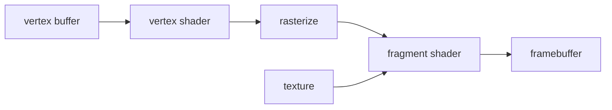

# 图形与渲染相关能力

- 前端里做图形，不是所有情况都应该用同一种技术。
- 先判断图形是结构化 UI（User Interface，用户界面）、矢量图、大量 2D 绘制，还是 GPU shader 处理。
- GPU（Graphics Processing Unit，图形处理器）适合做大量并行计算，shader 可以理解成运行在 GPU 上的小程序。

- DOM：
    - DOM 是 Document Object Model，文档对象模型。
    - 适合按钮、输入框、面板、列表、表单。
    - 优点是可访问性、事件、布局能力都成熟。
    - 缺点是大量节点频繁变化时成本高。

- SVG：
    - SVG 是 Scalable Vector Graphics，可缩放矢量图形。
    - 适合少量矢量图形、路径、图标、节点连线。
    - 图形元素仍然是 DOM 节点，可以直接绑定事件。
    - 大量 SVG 节点会变慢。

- Canvas：
    - 适合大量 2D 绘制、像素处理、游戏式刷新。
    - Canvas 不是 DOM 子节点，画完之后浏览器不知道每个图形对象是什么。
    - 命中测试、选择、撤销重做需要自己维护数据结构。

- WebGL / WebGPU：
    - WebGL 是 Web Graphics Library，浏览器里的 3D 图形接口。
    - WebGPU 是浏览器里更现代的 GPU 接口，能力更接近底层图形 API。
    - 适合 shader、纹理、GPU 加速图形计算。
    - 适合滤镜、后处理、粒子、大量并行计算。
    - 需要自己管理 shader、buffer、texture、framebuffer 等资源。

- 坐标系：
    - screen 坐标：鼠标在屏幕或窗口里的位置。
    - viewport 坐标：当前编辑器视口里的位置。
    - graph 坐标：节点图自己的世界坐标。
    - local 坐标：某个节点内部的局部坐标。

- devicePixelRatio：
    - devicePixelRatio 简称 DPR，表示 1 个 CSS 像素对应多少个物理像素。
    - CSS 像素不等于物理像素。
    - Canvas 和 WebGL 需要根据 DPR 放大 backing store。backing store 是 canvas 真正存像素的内存区域，太小就会在高分屏上发糊。

```js
const dpr = window.devicePixelRatio || 1;
canvas.width = Math.round(canvas.clientWidth * dpr);
canvas.height = Math.round(canvas.clientHeight * dpr);
```

- WebGL shader 的基础链路：
    - 准备顶点数据。
    - 编译 vertex shader。
    - 编译 fragment shader。
    - 上传纹理。
    - 绘制三角形。
    - fragment shader 为每个像素计算颜色。



- 判断图形代码是否靠谱：
    - 资源创建和释放是否成对。
    - 坐标转换是否集中管理。
    - 高分屏是否处理。
    - 大图、视频帧、纹理上传是否避免不必要重复。
    - 渲染循环是否只在必要时运行。

- 可运行示例：
    - [Canvas / WebGL 灰度滤镜示例](../examples/05-canvas-webgl-grayscale/index.html)
