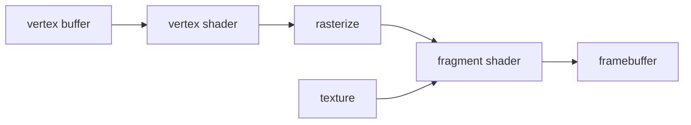

# 图形与渲染相关能力

- 前端里做图形，不是所有情况都应该用同一种技术。
- 先判断图形是结构化 UI（User Interface，用户界面）、矢量图、大量 2D 绘制，还是 GPU shader 处理。
- GPU（Graphics Processing Unit，图形处理器）适合做大量并行计算，shader 可以理解成运行在 GPU 上的小程序。

## DOM

- DOM 是 Document Object Model，文档对象模型。
- 适合按钮、输入框、面板、列表、表单。
- 优点是可访问性、事件、布局能力都成熟。
- 缺点是大量节点频繁变化时成本高。

## SVG

- SVG 是 Scalable Vector Graphics，可缩放矢量图形。
- 适合少量矢量图形、路径、图标、节点连线。
- 图形元素仍然是 DOM 节点，可以直接绑定事件。
- 大量 SVG 节点会变慢。
- SVG 实际是怎么渲染的（CPU 还是 GPU）？
    - 主流浏览器里，SVG 的矢量路径主要由 **CPU 光栅化（rasterize）**：用图形库（Chrome 的 Skia）把路径、曲线、填充算成一张位图（bitmap）。这一步是 CPU 干的，**通常不会把路径转成三角形 mesh 交给 GPU**。
    - 光栅化出来的位图会作为图层「贴图」上传给 **GPU**，GPU 负责把这些图层**合成（composite）**到屏幕，以及对图层整体做 `transform`/`opacity` 这类变换。
    - 所以可以记成：**画内容 = CPU，搬运/合成图层 = GPU**。这也解释了为什么「大量节点频繁变化」会卡——每次变化都要 CPU 重新光栅化；而只做平移/缩放/淡入淡出时，能只走 GPU 合成，就很流畅。
    - 注：业界有「GPU 直接渲染矢量路径（tessellation 生成 mesh）」的方案，但目前不是主流浏览器渲染普通 SVG 的默认路径。

## Canvas

- 适合大量 2D 绘制、像素处理、游戏式刷新。
- Canvas 不是 DOM 子节点，画完之后浏览器不知道每个图形对象是什么。
- 命中测试、选择、撤销重做需要自己维护数据结构。
- 准确地说：`<canvas>` 标签本身**是**一个 DOM 节点，能像普通元素一样挂在页面里；但你在它上面画的图形（线、圆、矩形）**不是** DOM 节点，只是画布上的一片像素。
- 挂载与绘制流程：① 页面里放一个 `<canvas>` 元素 → ② JS 拿到它、调用 `getContext("2d")` 拿到「画笔」(上下文对象) → ③ 用画笔在这块像素区域上作画。画完后 DOM 里始终只有 `<canvas>` 这一个节点，里面的图形浏览器无从感知。
- 简单例子：

```html
<!-- ① <canvas> 本身是 DOM 节点，正常挂在页面里 -->
<canvas id="c" width="200" height="120"></canvas>

<script>
  const canvas = document.getElementById("c");
  // ② 拿到 2D 绘图上下文，可以理解成「一支画笔」
  const ctx = canvas.getContext("2d");

  // ③ 用画笔在画布上画一个红色矩形——这是直接往像素上画，不产生任何子 DOM 节点
  ctx.fillStyle = "red";
  ctx.fillRect(20, 20, 100, 60);
  // 画完后想知道「这个矩形在哪、能不能点中」，得自己用变量记下它的坐标，浏览器不会帮你记。
</script>
```

- 怎么理解上面的 `<script>` 标签？
    - `<script>` 是用来在 HTML 里**嵌入/引入 JavaScript 代码**的标签，浏览器解析 HTML 读到它时，就会执行里面的代码。
    - **执行时机**：浏览器从上往下解析 HTML，读到 `<script>` 就停下来运行它（默认是「同步阻塞」的，跑完才继续往下解析）。所以这里 `<script>` 放在 `<canvas>` 之后很重要——能保证执行时 `<canvas>` 已经存在、`getElementById("c")` 能拿到它。
    - **只执行一遍吗？** 是的，这段「内联脚本」在页面加载时**自动执行一次**，之后不会自己重复运行。想再画（比如做动画、响应点击），要靠事件监听、`setInterval`、`requestAnimationFrame` 等**再次调用**绘制函数。
    - 补充：给 `<script src="...">` 加 `defer`/`async`、或脚本放在 `<head>` 里，会改变执行时机；上面这种「放在元素后面的内联脚本」是最简单、最直观的写法。

## WebGL / WebGPU

- WebGL 是 Web Graphics Library，浏览器里的 3D 图形接口。

- WebGL 1.0 和 2.0 的区别（简要）：
    - 血统：1.0 基于 OpenGL ES 2.0，2.0 基于 OpenGL ES 3.0；2.0 是超集，1.0 能做的它都能做。
        - ES = Embedded Systems（嵌入式系统）。OpenGL ES 是 OpenGL 的精简版，最初为手机、嵌入式等资源受限设备设计；WebGL 就建立在它之上。
        - OpenGL ES 版本和 GLSL ES 版本是绑定的：每个 OpenGL ES 版本配套规定了它使用的 GLSL ES 版本，不能自由组合。对应关系：OpenGL ES 2.0 → GLSL ES 1.00，OpenGL ES 3.0 → GLSL ES 3.00（注意没有所谓 2.00，版本号是跳着对应的）。
    - 着色器语言：1.0 用 GLSL ES 1.00，2.0 用 GLSL ES 3.00（语法更新、功能更强，写法略有不同）。
    - 多了哪些常用能力：2.0 原生支持多渲染目标(MRT)、3D 纹理、整数纹理、Uniform Buffer Object、变换反馈、实例化绘制、非 2 次幂纹理等；这些在 1.0 里要么没有、要么得靠扩展且不保证可用。
        - 变换反馈（Transform Feedback）：让 vertex shader 计算出的结果不去绘制，而是「写回」到一个 buffer 里留着下次用。
            - 平时管线是「顶点数据 → shader 处理 → 画到屏幕」，结果用完即弃；变换反馈相当于在中途接根管子，把 shader 算出的顶点数据截留下来。
            - 用途：在 GPU 上做可迭代的计算，典型是粒子系统——这一帧用 shader 算出每个粒子的新位置/速度写回 buffer，下一帧拿它当输入接着算，全程不经过 CPU，非常快。
            - 一句话：它把 GPU 当成「能把计算结果存下来反复迭代」的计算器，而不只是「画一次就丢」的绘图器。
    - 兼容性：1.0 支持最广（几乎所有设备），2.0 现代浏览器普遍支持，但极老设备可能没有。
    - 怎么选用：`canvas.getContext("webgl2")` 拿 2.0，`getContext("webgl")` 拿 1.0；常见写法是先试 webgl2、拿不到再退回 webgl。
    - 对本教程示例：05 示例用的是 `getContext("webgl")`（1.0），因为灰度滤镜很简单，1.0 足够且兼容性最好。

- WebGPU 是浏览器里更现代的 GPU 接口，能力更接近底层图形 API。
- 适合 shader、纹理、GPU 加速图形计算。
- 适合滤镜、后处理、粒子、大量并行计算。
- 需要自己管理 shader、buffer、texture、framebuffer 等资源。

## 坐标系

- screen 坐标：鼠标在屏幕或窗口里的位置。
- viewport 坐标：当前编辑器视口里的位置。
- graph 坐标：节点图自己的世界坐标。
- local 坐标：某个节点内部的局部坐标。

## devicePixelRatio

- devicePixelRatio 简称 DPR，表示 1 个 CSS 像素对应多少个物理像素。
- CSS 像素不等于物理像素。
- Canvas 和 WebGL 需要根据 DPR 放大 backing store。backing store 是 canvas 真正存像素的内存区域，太小就会在高分屏上发糊。

```js
const dpr = window.devicePixelRatio || 1;
canvas.width = Math.round(canvas.clientWidth * dpr);
canvas.height = Math.round(canvas.clientHeight * dpr);
```

## WebGL shader 的基础链路

- 准备顶点数据。
- 编译 vertex shader。
- 编译 fragment shader。
- 上传纹理。
- 绘制三角形。
- fragment shader 为每个像素计算颜色。


```mermaid
flowchart LR
    A["vertex buffer"] --> B["vertex shader"]
    B --> C["rasterize"]
    C --> D["fragment shader"]
    E["texture"] --> D
    D --> F["framebuffer"]
```

## 判断图形代码是否靠谱

- 资源创建和释放是否成对。
- 坐标转换是否集中管理。
- 高分屏是否处理。
    - 「高分屏」指 Retina 这类高像素密度屏幕：1 个 CSS 像素对应多个物理像素（倍数就是 `window.devicePixelRatio`，常见 2 或 3）。
    - 如果不处理，Canvas/WebGL 画出来的图在高分屏上会发虚、发糊。常见做法：把画布的实际分辨率乘以 `devicePixelRatio`（如 `canvas.width = cssWidth * dpr`），再用 CSS 把显示尺寸缩回去，这样才清晰。
- 大图、视频帧、纹理上传是否避免不必要重复。
- 渲染循环是否只在必要时运行。

## 可运行示例

- [Canvas / WebGL 灰度滤镜示例](../examples/05-canvas-webgl-grayscale/index.html)
