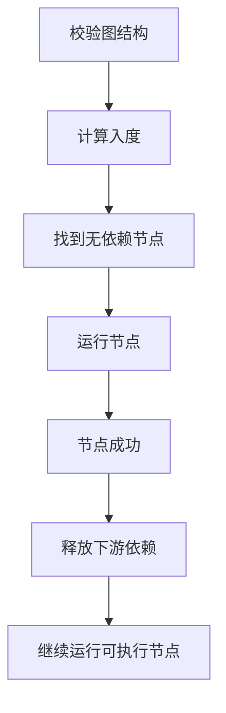

# AIGC Workflow 与任务调度

- AIGC 是 AI Generated Content，人工智能生成内容。AIGC workflow 本质上是一张图。
- 节点表示一个处理步骤。
- 边表示数据依赖。
- 调度器要根据依赖关系决定哪些节点可以运行、什么时候运行、失败后怎么处理。

- 基础数据结构：
    - node：节点，包含 id、type、params、status。
    - edge：边，表示 from 节点的输出连接到 to 节点的输入。
    - graph：节点和边组成的 workflow。

```ts
type WorkflowNode = {
  id: string;
  type: string;
  params: Record<string, unknown>;
  status: "idle" | "pending" | "running" | "success" | "failed";
};

type WorkflowEdge = {
  from: string;
  to: string;
};
```

- DAG：
    - DAG 是 Directed Acyclic Graph，有向无环图。
    - workflow 通常应该是有向无环图。
    - 有向表示数据有流向。
    - 无环表示不能出现 A 依赖 B，B 又依赖 A。
    - 如果有环，调度器就无法判断谁先执行。

- 调度流程：



- 节点状态：
    - `idle`：还没开始。
    - `pending`：等待依赖或排队。
    - `running`：正在执行。
    - `success`：执行成功。
    - `failed`：执行失败。
    - `cancelled`：被取消。

- 模型服务调用方式：
    - REST 是 Representational State Transfer，表现层状态转移。这里可以简单理解成用 HTTP 接口操作资源，适合短请求，或者提交任务。
    - 轮询：适合任务提交后定期查询结果。
    - SSE 是 Server-Sent Events，服务端事件推送。它适合服务端持续推送进度。
    - WebSocket 是浏览器和服务器之间的一条长连接，适合双向实时通信。

- 任务控制：
    - 取消：用户不想等了，或者参数已改变。
    - 超时：服务异常时不能无限等待。
    - 重试：网络波动或临时失败可以再试一次。
    - 并发限制：避免同时把太多模型任务打出去。
    - 失败恢复：失败节点的下游不能继续盲目执行。

- 判断 workflow 调度代码是否靠谱：
    - 是否先校验 DAG。
    - 状态流转是否有限且清楚。
    - 取消和失败是否能正确停止下游。
    - 日志里是否能追踪一次运行。
    - 前后端协议是否能表达错误和进度。

- 可运行示例：
    - [AIGC workflow 调度模拟示例](../examples/06-workflow-scheduler/index.html)
