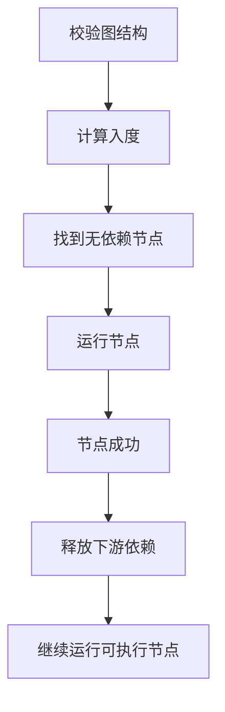

# AIGC Workflow 与任务调度

- AIGC 是 AI Generated Content，人工智能生成内容。AIGC workflow 本质上是一张图。
- 节点表示一个处理步骤。
- 边表示数据依赖。
- 调度器要根据依赖关系决定哪些节点可以运行、什么时候运行、失败后怎么处理。

## 基础数据结构

- node：节点，包含 id、type、params、status。
- edge：边，表示 from 节点的输出连接到 to 节点的输入。
- graph：节点和边组成的 workflow。

```ts
type WorkflowNode = {
  id: string;
  type: string;
  // Record<string, unknown> 是 TypeScript 类型，表示「键是字符串、值类型未知」的对象，
  // 等价于 { [key: string]: unknown }。这里用来装节点的参数：每个节点参数名不同、值类型也各异
  // (步数是数字、提示词是字符串…)，所以键值都开放。
  // 用 unknown 而非 any：unknown 取出后必须先判断/收窄类型才能用，更安全；any 则完全放弃检查。
  params: Record<string, unknown>;
  // 取值和下面「节点状态」一节一一对应；cancelled 表示被取消（见示例里的取消逻辑）。
  status: "idle" | "pending" | "running" | "success" | "failed" | "cancelled";
};

type WorkflowEdge = {
  from: string;
  to: string;
};
```

## DAG

- DAG 是 Directed Acyclic Graph，有向无环图。
- workflow 通常应该是有向无环图。
- 有向表示数据有流向。
- 无环表示不能出现 A 依赖 B，B 又依赖 A。
- 如果有环，调度器就无法判断谁先执行。

## 调度流程


```mermaid
flowchart TD
    A["校验图结构"] --> B["计算入度"]
    B --> C["找到无依赖节点"]
    C --> D["运行节点"]
    D --> E["节点成功"]
    E --> F["释放下游依赖"]
    F --> G["继续运行可执行节点"]
```

## 节点状态

- `idle`：还没开始。
- `pending`：等待依赖或排队。
- `running`：正在执行。
- `success`：执行成功。
- `failed`：执行失败。
- `cancelled`：被取消。

## 模型服务调用方式

- REST（Representational State Transfer，表现层状态转移）：
    - 是什么：最常见的 HTTP 接口风格，发一个请求、拿一个响应，一问一答就结束。
    - 适合：快速能返回结果的短请求，或「提交一个任务、拿到任务 id」这种动作。不适合等很久或要持续更新的场景。
- 轮询（polling）：
    - 是什么：客户端每隔一段时间（如每 2 秒）重复发请求问「好了吗」，直到任务完成。
    - 适合：任务耗时、但服务端只提供「查询接口」、不会主动推送的情况。实现最简单，代价是有延迟、有多余请求。
- SSE（Server-Sent Events，服务端事件推送）：
    - 是什么：客户端连一次，服务端就能源源不断【单向】往客户端推消息，连接保持着。
    - 适合：服务端要持续上报进度/日志，而客户端不用回话的场景，比如 AIGC 任务的实时进度条。比轮询更及时、更省请求。
- WebSocket：
    - 是什么：浏览器和服务器之间建立的一条【双向】长连接，两边都能随时主动发消息。
    - 适合：需要双向实时交互的场景，比如多人协同编辑、实时聊天、需要随时下发控制指令。功能最强，但实现和运维也最重。

## 任务控制

- 取消：用户不想等了，或者参数已改变。
- 超时：服务异常时不能无限等待。
- 重试：网络波动或临时失败可以再试一次。
- 并发限制：避免同时把太多模型任务打出去。
- 失败恢复：失败节点的下游不能继续盲目执行。

## 判断 workflow 调度代码是否靠谱

- 是否先校验 DAG。
- 状态流转是否有限且清楚。
- 取消和失败是否能正确停止下游。
- 日志里是否能追踪一次运行。
- 前后端协议是否能表达错误和进度。

## 可运行示例

- [AIGC workflow 调度模拟示例](../examples/06-workflow-scheduler/index.html)
