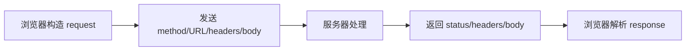
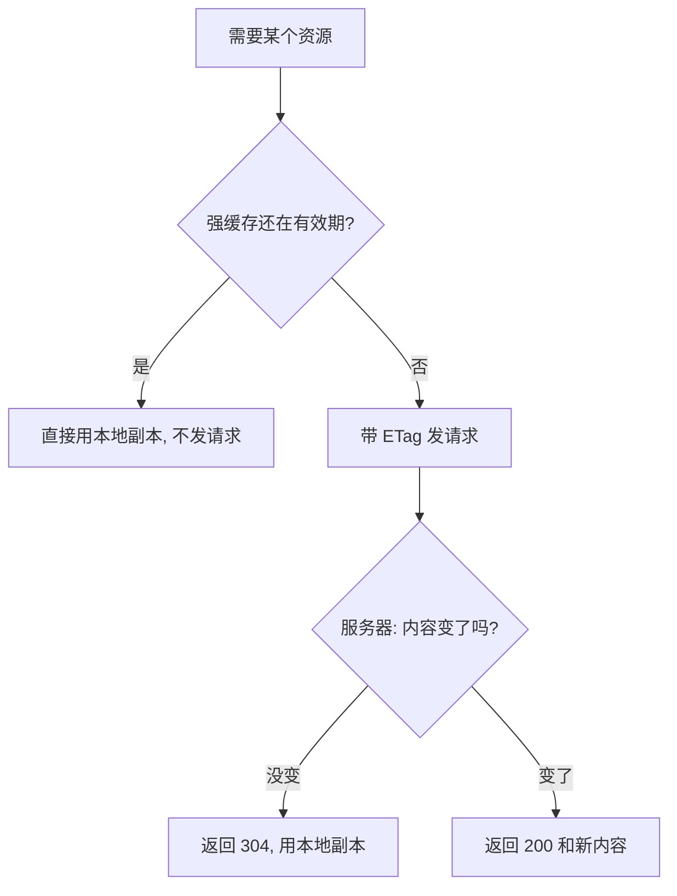

# 浏览器与网络基础

- 前端代码本质上一直在做两件事：操作页面、和服务器通信。
- 这一篇讲第二件事：浏览器是怎么发请求、拿响应、存数据的。
- 对你的项目来说，调度模型服务、上传图片、下载结果，全都建立在这套机制上。

## HTTP 是什么

- HTTP 是浏览器和服务器之间的一问一答协议。
- 浏览器发出一个 request，服务器返回一个 response，一次往返结束。
- HTTP 本身是无状态的：服务器默认不记得你上一次问过什么，状态要靠 Cookie / Token 额外携带。

- 一个 request 由四部分组成：
    - method：想做什么（GET 读、POST 新建、PUT 整体更新、PATCH 局部更新、DELETE 删除）。
    - URL：资源在哪。
    - headers：附加说明，比如内容类型、身份凭证。
    - body：要发送的数据（GET 通常没有 body）。

- 一个 response 也有对应结构：
    - status code：这次请求的结果（见下）。
    - headers：响应的附加说明，比如缓存策略、内容类型。
    - body：返回的数据，通常是 JSON、图片或文件流。



## HTTPS 和 HTTP 的区别

- HTTPS 就是 HTTP 加一层 TLS 加密。
- 它解决三个问题：内容不被中间人偷看、内容不被篡改、确认你连的确实是目标服务器。
- 对前端而言，绝大多数线上接口、CDN、第三方模型服务都要求 HTTPS。
- 一个常见坑：HTTPS 页面里发 HTTP 请求会被浏览器拦截（混合内容），所以接口和页面要同协议。

## 状态码

- 状态码是服务器对这次请求的分类回答，记大类即可。
    - 2xx 成功：200 正常，201 已创建，204 成功但无内容。
    - 3xx 重定向：301 永久跳转，302 临时跳转，304 命中缓存没变化。
    - 4xx 客户端错：400 请求格式错，401 没登录，403 没权限，404 找不到，429 请求太频繁。
    - 5xx 服务端错：500 服务器内部错，502/503/504 网关或服务不可用。
- 判断问题方向的快捷法：4xx 多半是前端请求本身的问题，5xx 多半是后端的问题。

## 缓存

- 缓存的目的是让浏览器尽量不重复下载没变的资源。
- 分两种思路：强缓存和协商缓存。

- 强缓存：
    - 服务器用 `Cache-Control` 告诉浏览器「这段时间内别再问我」。
    - 例如 `Cache-Control: max-age=31536000` 表示一年内直接用本地副本。
    - 命中强缓存时根本不发请求。

- 协商缓存：
    - 浏览器带上一个标识去问服务器「我手里这份还能用吗」。
    - 标识可以是 `ETag`（内容指纹）或 `Last-Modified`（最后修改时间）。
    - 没变化时服务器返回 304，body 为空，省下传输。



- 实践中的常见策略：
    - 带 hash 的 JS / CSS（如 `app.3f9c.js`）可以长期强缓存，因为内容一变文件名就变。
    - HTML 入口文件不要强缓存，否则发布后用户还拿着旧版本。

## 跨域与 CORS

- 浏览器有同源策略：协议、域名、端口三者完全相同才算同源。
- 不同源的接口请求，默认会被浏览器拦截响应，这是浏览器的安全限制，不是 bug。
- CORS 是服务器主动开口子的机制：服务器在响应头里声明「我允许哪些来源访问」。
    - `Access-Control-Allow-Origin` 指定允许的来源。
    - 复杂请求前，浏览器会先发一个 OPTIONS 预检请求问服务器允不允许。
- 关键认知：CORS 由服务端配置决定，前端改不了。前端遇到跨域报错，要找后端加白名单，或在开发期用本地代理。

## Cookie 与 Token

- 两者都用来解决「服务器怎么知道这个请求是谁发的」。

- Cookie：
    - 浏览器自动存储，并在每次请求时自动带上。
    - 服务器通过响应头 `Set-Cookie` 写入。
    - 加 `HttpOnly` 后 JS 读不到，能挡 XSS 偷取；加 `SameSite` 能挡一部分 CSRF。

- Token（如 JWT）：
    - 通常由前端拿到后自己保存，再手动放进请求头 `Authorization: Bearer <token>`。
    - 不会被浏览器自动携带，所以天然不受 CSRF 影响，但要自己管理存储和过期。

- 选择思路：
    - 强调防 XSS、希望自动携带 → HttpOnly Cookie。
    - 前后端分离、多端共用、跨域调用多 → Token。

## 浏览器存储

- 浏览器提供几种本地存储，按用途选。
    - localStorage：键值对，持久保存，除非手动清，容量约几 MB，同步 API。
    - sessionStorage：和 localStorage 一样，但关闭标签页就清空。
    - Cookie：每次请求自动带上，容量很小，适合身份标识而非数据存储。
    - IndexedDB：浏览器内置的异步数据库，能存大量结构化数据和二进制，适合缓存图片、模型产物、离线数据。
- 经验法则：小配置用 localStorage，大数据或二进制用 IndexedDB，身份凭证优先考虑 Cookie 的安全属性。

## 文件上传与下载

- 上传：
    - 用 `FormData` 把文件和字段打包，浏览器会自动设好 multipart 的请求头。
    - 大文件可以切片分块上传，再在后端拼接，避免单次请求过大或超时。

```js
// 上传一张图片：FormData 会被当作 multipart 表单发送
const form = new FormData();
form.append("file", fileInput.files[0]); // file 是后端约定的字段名
form.append("name", "input.png");

await fetch("/api/upload", {
  method: "POST",
  body: form, // 不要手动设 Content-Type, 浏览器会自动带 boundary
});
```

- 下载：
    - 接口返回的二进制可以转成 Blob，再生成一个临时 URL 触发下载。

```js
// 把接口返回的二进制保存为本地文件
const res = await fetch("/api/result");
const blob = await res.blob();          // 拿到二进制数据
const url = URL.createObjectURL(blob);  // 生成一个临时的本地 URL

const a = document.createElement("a");
a.href = url;
a.download = "result.png";              // 下载时的文件名
a.click();

URL.revokeObjectURL(url);               // 用完释放, 否则占内存
```

## 判断网络相关代码是否靠谱

- 请求失败时是否区分了 4xx 和 5xx，并给出不同处理。
- 身份凭证的存储方式是否和安全要求匹配。
- 缓存策略是否能保证发布后用户拿到新版本。
- 跨域问题是否找对了责任方（后端配置而非前端硬绕）。
- 大文件上传下载是否考虑了超时、分块和内存释放。
