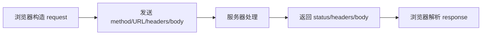
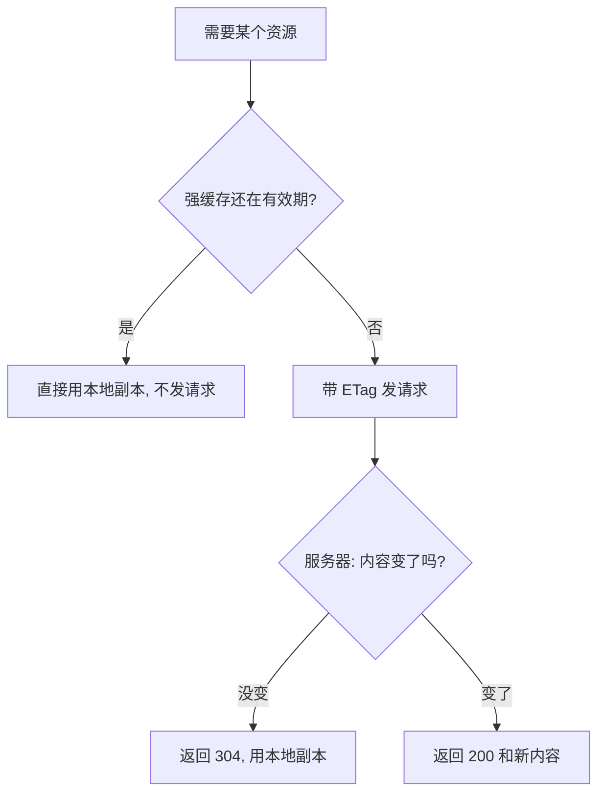

# 浏览器与网络基础

- 前端代码本质上一直在做两件事：操作页面、和服务器通信。
- 这一篇讲第二件事：浏览器是怎么发请求、拿响应、存数据的。
- 对你的项目来说，调度模型服务、上传图片、下载结果，全都建立在这套机制上。

- HTTP 是什么：

- HTTP 是 HyperText Transfer Protocol，超文本传输协议，是浏览器和服务器之间的一问一答协议。
- 浏览器发出一个 request，服务器返回一个 response，一次往返结束。
- HTTP 本身是无状态的：服务器默认不记得你上一次问过什么，状态要靠 Cookie / Token 额外携带。

- 一个 request 由四部分组成：
    - method：请求方法，表示想做什么（GET 读、POST 新建、PUT 整体更新、PATCH 局部更新、DELETE 删除）。
        - PUT 整体更新：用你发来的数据“整个替换”掉原资源——你得把这条记录所有字段都带上，没带的字段会被清空或重置。好比交一份新表格盖在旧的上面。
        - PATCH 局部更新：只改你指定的那几个字段，其它字段保持不变。好比只在表格里涂改某一格。
        - 举例：用户资料有 name、age、email 三个字段，只想改 age：
            - 用 PUT 得发 `{ name, age: 新值, email }` 三个都带上，漏带的会丢；
            - 用 PATCH 只发 `{ age: 新值 }` 即可，name 和 email 不动。
    - URL：Uniform Resource Locator，统一资源定位符，表示资源在哪。
    - headers：附加说明，比如内容类型、身份凭证。
    - body：要发送的数据（GET 通常没有 body）。

- 一个 response 也有对应结构：
    - status code：状态码，表示这次请求的结果。
    - headers：响应的附加说明，比如缓存策略、内容类型。
    - body：返回的数据，通常是 JSON、图片或文件流。JSON 是 JavaScript Object Notation，一种常用的数据交换格式。


```mermaid
flowchart LR
    A["浏览器构造 request"] --> B["发送 method/URL/headers/body"]
    B --> C["服务器处理"]
    C --> D["返回 status/headers/body"]
    D --> E["浏览器解析 response"]
```

- HTTPS 和 HTTP 的区别：

- HTTPS 是 HTTP Secure，安全的 HTTP，可以理解成 HTTP 加一层 TLS 加密。
- TLS 是 Transport Layer Security，传输层安全协议，用来加密通信并验证服务器身份。
- 它解决三个问题：内容不被中间人偷看、内容不被篡改、确认你连的确实是目标服务器。
- 对前端而言，绝大多数线上接口、CDN（Content Delivery Network，内容分发网络）、第三方模型服务都要求 HTTPS。
- 一个常见坑：HTTPS 页面里发 HTTP 请求会被浏览器拦截（混合内容），所以接口和页面要同协议。

- 状态码：

- 状态码是服务器对这次请求的分类回答，记大类即可。
    - 2xx 成功：200 正常，201 已创建，204 成功但无内容。
    - 3xx 重定向：301 永久跳转，302 临时跳转，304 命中缓存没变化。
    - 4xx 客户端错：400 请求格式错，401 没登录，403 没权限，404 找不到，429 请求太频繁。
    - 5xx 服务端错：500 服务器内部错，502/503/504 网关或服务不可用。
- 判断问题方向的快捷法：4xx 多半是前端请求本身的问题，5xx 多半是后端的问题。

- 缓存：

- 缓存的目的是让浏览器尽量不重复下载没变的资源。
- 分两种思路：强缓存和协商缓存。

- 强缓存：
    - 服务器用 `Cache-Control` 告诉浏览器「这段时间内别再问我」。
    - 例如 `Cache-Control: max-age=31536000` 表示一年内直接用本地副本。
    - 命中强缓存时根本不发请求。

- 协商缓存：
    - 浏览器带上一个标识去问服务器「我手里这份还能用吗」。
    - 标识可以是 `ETag`（内容指纹）或 `Last-Modified`（最后修改时间）。
    - 没变化时服务器返回 304，body 为空，省下传输。


```mermaid
flowchart TD
    A["需要某个资源"] --> B{"强缓存还在有效期?"}
    B -- "是" --> C["直接用本地副本, 不发请求"]
    B -- "否" --> D["带 ETag 发请求"]
    D --> E{"服务器: 内容变了吗?"}
    E -- "没变" --> F["返回 304, 用本地副本"]
    E -- "变了" --> G["返回 200 和新内容"]
```

- 实践中的常见策略：
    - 带 hash 的 JavaScript / CSS（如 `app.3f9c.js`）可以长期强缓存，因为内容一变文件名就变。
    - HTML 入口文件不要强缓存，否则发布后用户还拿着旧版本。

- 跨域与 CORS：

- 浏览器有同源策略：协议、域名、端口三者完全相同才算同源。
- 不同源的接口请求，默认会被浏览器拦截响应，这是浏览器的安全限制，不是 bug。
- CORS 是 Cross-Origin Resource Sharing，跨源资源共享。
- CORS 是服务器主动开口子的机制：服务器在响应头里声明「我允许哪些来源访问」。
    - `Access-Control-Allow-Origin` 指定允许的来源。
    - 复杂请求前，浏览器会先发一个 OPTIONS 预检请求问服务器允不允许。
- 关键认知：CORS 由服务端配置决定，前端改不了。前端遇到跨域报错，要找后端加白名单，或在开发期用本地代理。

- Cookie 与 Token：

- 两者都用来解决「服务器怎么知道这个请求是谁发的」。

- 通俗理解（先建立直觉，再看下面的技术细节）：
    - 背景：前面说过 HTTP 是无状态的，每次请求对服务器来说都像「陌生人初次见面」，处理完就忘了你是谁。可登录、购物车这些功能偏偏需要「记住你」，于是就有了 Cookie 和 Token——本质都是让你每次请求都带上一张「身份凭证」，服务器一看凭证就知道你是谁。
    - Cookie 是什么：一小段服务器发给浏览器、由浏览器自动保存并在之后每次请求自动带上的数据。关键词是「自动」——你写代码时不用手动管。
        - 例子（登录）：
            1. 你输入账号密码登录，服务器验证通过，在响应里塞一句 `Set-Cookie: session=abc123`。
            2. 浏览器自动把 `session=abc123` 存起来。
            3. 之后你访问这个网站的任何页面，浏览器都自动在请求头里带上 `Cookie: session=abc123`。
            4. 服务器一看 `abc123`，查出「哦这是张三」，于是显示张三的个人主页。
        - 打个比方：Cookie 像游乐园入园时盖在手背上的章，之后你玩每个项目，工作人员看一眼手背的章就放行，你不用反复买票。
    - Token（令牌）是什么：也是一张身份凭证（最常见的是 JWT，JSON Web Token，一种把用户信息编码并带签名的字符串令牌），但通常由前端代码自己保存（如存在 `localStorage`），并在请求时手动放进请求头里带上，浏览器不会自动处理。
        - `localStorage` 是浏览器提供的一块本地键值存储（按域名隔离），用 `localStorage.setItem(key, value)` 存、`getItem(key)` 取；数据只能是字符串，且会一直留着（关掉页面、重启浏览器也不丢，除非手动清除）。
        - 例子（登录）：
            1. 登录成功，服务器返回一串 token，比如 `eyJhbGci...`（一串编码后的字符串，里面装着「用户=张三、过期时间=...」等信息）。
            2. 前端把它存进 `localStorage`。
            3. 之后每次发请求，前端代码手动加上请求头 `Authorization: Bearer eyJhbGci...`。
            4. 服务器验证这串 token 没被伪造、没过期，就知道是张三。
        - 打个比方：Token 像一张演唱会电子票，票面本身就写明了「持票人、座位、有效期」，检票时扫一下票即可，主办方不需要回后台翻名单。
    - 两者最直观的区别：
        - 谁来携带：Cookie 浏览器自动带；Token 前端代码手动带。
        - 存哪：Cookie 存浏览器 Cookie 区；Token 一般存 `localStorage` 等。
        - 典型场景：Cookie 多用于传统网站、同源；Token 多用于前后端分离、App、跨域 API。
            - 什么是「源」：一个网址的源由三部分组成——协议（http/https）+ 域名 + 端口，三者全都相同才算「同源」，只要有一个不同就是「跨域」。注意路径不算（只看到端口为止）。
            - 以 `https://example.com` 为基准：`https://example.com/api` 同源；`http://example.com`（协议不同）、`https://api.example.com`（子域名也算不同域名）、`https://example.com:3000`（端口不同）都属于跨域。
            - 为什么重要：浏览器有「同源策略」——网页里的 JS 默认只能自由访问同源资源，访问跨域资源会被拦截，目的是防止你打开的网页偷偷拿你在别的网站的登录状态去发请求。
            - 对应到上面：同源时 Cookie 自动携带最省事；前后端分离常是 `app.example.com` 访问 `api.example.com`（已跨域），或手机 App、第三方调 API，这些场景改用「手动带 Token」更灵活。
            - 补充：跨域并非做不了，而是需要服务器通过 CORS（跨域资源共享）明确声明「允许这个源访问」。
    - 一句话：Cookie 是「浏览器自动揣着的通行证」，Token 是「你自己揣着、用时主动出示的通行证」。两者都是为了在无状态的 HTTP 上「伪造出」一种「服务器记得你」的效果。

- Cookie：
    - 浏览器自动存储，并在每次请求时自动带上。
    - 服务器通过响应头 `Set-Cookie` 写入。
    - 加 `HttpOnly` 后 JavaScript 读不到，能挡 XSS 偷取；加 `SameSite` 能挡一部分 CSRF。
        - XSS（Cross-Site Scripting，跨站脚本攻击）：攻击者想办法让一段恶意 JavaScript 在你的页面里执行（比如评论区注入脚本），从而偷数据、冒充你操作。
        - CSRF（Cross-Site Request Forgery，跨站请求伪造）：攻击者在自己的网站上诱导你的浏览器，向你已登录的另一个网站发请求；由于 Cookie 会被浏览器自动带上，那个网站误以为是你本人在操作。
        - 这句话拆开看：
            - `HttpOnly` 是给 Cookie 加的一个标记，加了之后页面里的 JavaScript 就读不到这个 Cookie（`document.cookie` 拿不到它）。所以即使页面被注入了恶意脚本（XSS），脚本也偷不走这个 Cookie——这就是「挡 XSS 偷取」。
            - `SameSite` 是另一个标记，限制「从别的网站发起的请求」要不要带上这个 Cookie。设置后，从攻击者网站发往你已登录网站的请求就不会自动携带 Cookie，那个网站收不到凭证就不会误认成你——这就是「挡一部分 CSRF」（说「一部分」是因为它只覆盖跨站场景，不是万能）。

- Token（如 JWT）：
    - JWT 是 JSON Web Token，一种常见的 token 格式。
    - 通常由前端拿到后自己保存，再手动放进请求头 `Authorization: Bearer <token>`。
    - 不会被浏览器自动携带，所以天然不受 CSRF 影响，但要自己管理存储和过期。

- 选择思路：
    - 强调防 XSS、希望自动携带 → HttpOnly Cookie。
    - 前后端分离、多端共用、跨域调用多 → Token。

- 浏览器存储：

- 浏览器提供几种本地存储，按用途选。
    - localStorage：键值对，持久保存，除非手动清，容量约几 MB，同步 API。MB 是 megabyte，兆字节；API 是 Application Programming Interface，应用程序编程接口。
    - sessionStorage：和 localStorage 一样，但关闭标签页就清空。
    - Cookie：每次请求自动带上，容量很小，适合身份标识而非数据存储。
        - 存在哪：浏览器自己管理的一块专门存储区（俗称 Cookie jar），按域名隔离保存到本地，和 localStorage 是分开的两块地方。
        - 和其他存储最大的不同：不只是本地存着，每次向对应域名发请求时，浏览器会自动把它塞进请求头带过去——这正是它适合做身份标识的原因（服务器每次都能自动收到，用来认人）。
        - 容量：非常小。每条 Cookie 通常上限约 4KB，每个域名能存的条数也有限（一般几十条）。
        - 为什么故意做这么小：正因为它每次请求都自动携带，存大了等于给每个请求都背上包袱、浪费带宽拖慢速度。所以只放 session id、token 这种几十字节的小东西，大数据交给 localStorage（约几 MB）或 IndexedDB。
    - IndexedDB：浏览器内置的异步数据库，能存大量结构化数据和二进制，适合缓存图片、模型产物、离线数据。
        - 它本身只是浏览器规范定义的一套 API 标准，底层用什么数据库引擎由各浏览器自己实现：Chrome / Edge 等 Chromium 系用 LevelDB（Google 的键值存储库），Firefox 和 Safari 用 SQLite。
        - 虽然有的底层是 SQLite（关系型），但它暴露给你的是 NoSQL 风格的对象存储模型：存的是一个个 JavaScript 对象、按 key 存取，可以给字段建索引来查询，你不写 SQL，而是用 `objectStore`、`index`、`cursor` 这些 API。
        - 底层引擎只是实现细节，你碰不到也不该依赖：同一段代码在不同浏览器上行为一致，磁盘文件格式是浏览器内部的事，不对外暴露。
        - 数据存在浏览器为每个源（origin）单独划出的私有目录里，按域名隔离，清除浏览器数据时会被清掉。
        - 一个最小例子，串起 `objectStore`、`index`、`cursor` 三个 API：

```js
// 1. 打开（或创建）名为 myDB 的数据库，第二个参数是版本号。
//    想升级结构（加表 / 加索引）时，就把这个版本号调大（如 1 → 2），
//    浏览器发现本地版本比它小，才会触发下面的 onupgradeneeded。
const req = indexedDB.open("myDB", 2);

// 2. 只有首次创建、或版本号变大时，才会触发 onupgradeneeded，
//    “建表”和“建索引”的结构定义只能在这里做。
//    注意：版本升级时这里会再次执行，所以不能无脑 createObjectStore，
//    否则对已存在的表重复创建会抛 ConstraintError。
//    标准做法是用 e.oldVersion（升级前的版本号，全新用户为 0）做“阶梯式迁移”：
//    每个 if 只负责自己那一档的增量改动，无论用户从 0 直接跳到最新，还是逐版升级，都不重不漏。
req.onupgradeneeded = (e) => {
  const db = e.target.result;
  const oldVersion = e.oldVersion;
  // 结构变更也要通过这次升级事务来拿已存在的 store（加索引时会用到）
  const tx = e.target.transaction;

  if (oldVersion < 1) {
    // 0 → 1：首次建表。
    // objectStore 相当于一张“表”：这里存用户，主键是 id
    const store = db.createObjectStore("users", { keyPath: "id" });
    // index 是“二级索引”：让我们能按 age 字段查询，而不只是按主键 id。
    // createIndex(索引名, 要索引的字段)：
    //   第一个参数 "byAge" 是索引的名字，自己起的，之后用 store.index("byAge") 按名字取它；
    //   第二个参数 "age" 是被索引的字段（keyPath），表示“为每条记录的 age 建一份排好序的目录”。
    // 没有索引时只能用主键 id 查；建了这个索引后，就能按 age 高效查找 / 范围遍历（见下方 cursor）。
    // 类比：objectStore 是按身份证号(id)排的花名册，index 则额外按年龄(age)又排了一份目录。
    store.createIndex("byAge", "age");
  }

  if (oldVersion < 2) {
    // 1 → 2：示例性的增量升级——只给已存在的 users 表再加一个按 name 的索引，
    // 不再重复创建 store。已存在的 store 要从升级事务里取：
    const store = tx.objectStore("users");
    store.createIndex("byName", "name");
  }
};

req.onsuccess = (e) => {
  const db = e.target.result;

  // 3. 所有读写都要在事务里进行；"readwrite" 表示要写
  const tx = db.transaction("users", "readwrite");
  const store = tx.objectStore("users");

  // 写入几条对象（注意存的就是普通 JS 对象，不写 SQL）
  store.put({ id: 1, name: "张三", age: 20 });
  store.put({ id: 2, name: "李四", age: 30 });

  // 4. 用 index + cursor 遍历 age >= 25 的记录
  //    IDBKeyRange.lowerBound(25) 表示“从 25 往上”的范围
  const range = IDBKeyRange.lowerBound(25);
  store.index("byAge").openCursor(range).onsuccess = (ev) => {
    const cursor = ev.target.result;
    if (cursor) {
      console.log(cursor.value); // { id: 2, name: "李四", age: 30 }
      cursor.continue();         // 移到下一条，没有了 cursor 就是 null
    }
  };
};
```

- 经验法则：小配置用 localStorage，大数据或二进制用 IndexedDB，身份凭证优先考虑 Cookie 的安全属性。

- 文件上传与下载：

- 上传：
    - 用 `FormData` 把文件和字段打包，浏览器会自动设好 multipart 的请求头。
        - `FormData` 是谁提供的：它是浏览器内置的 Web API（不是某个第三方库，也不是 JS 语言本身的一部分），直接 `new FormData()` 就能用；Node.js 较新版本也内置了它。
        - 它做的事：把若干「字段名 → 值」收集成一个表单对象，值可以是普通字符串，也可以是文件（`File` / `Blob`）。用 `append(名字, 值)` 往里加。
        - 配合 `fetch` 时的关键：把 `FormData` 作为 `body` 传进去，浏览器会自动按 multipart 格式编码，并自动设置正确的 `Content-Type` 请求头——所以你「不要」手动设 `Content-Type`，否则会缺少分隔标记导致后端解析失败。
    - multipart 是一种表单提交格式，适合同时传文件和普通字段。
        - 全名是 `multipart/form-data`，是一个 HTTP `Content-Type`（请求体的编码格式）。
        - 「multipart（多部分）」的含义：把请求体切成多个 part，每个字段（一段文本、或一个文件）各占一个 part，之间用一串随机生成的分隔符（boundary）隔开。
        - 为什么传文件要用它：普通表单格式（`application/x-www-form-urlencoded`）只适合短文本，无法安全携带二进制；multipart 用 boundary 分隔，每个 part 可带自己的文件名和类型，能原样传二进制，且文本和文件可混在一次请求里。
        - boundary 就是上面代码注释说的「分隔符」：浏览器自动生成并写进 `Content-Type`（如 `Content-Type: multipart/form-data; boundary=----xxx`），这也是你不能手动设 `Content-Type` 的原因——手动设就丢了这个 boundary。
    - 大文件可以切片分块上传，再在后端拼接，避免单次请求过大或超时。

```js
// 上传一张图片：FormData 会被当作 multipart 表单发送
const form = new FormData();
form.append("file", fileInput.files[0]); // file 是后端约定的字段名
form.append("name", "input.png");

await fetch("/api/upload", {
  method: "POST",
  body: form, // 不要手动设 Content-Type, 浏览器会自动带 boundary
});
```

- 分块上传的简单示例：核心是用 `file.slice(start, end)` 把大文件切成多块，逐块发送，后端按序号拼回。

```js
// 把一个大文件切成 5MB 一块，逐块上传
const file = fileInput.files[0];
const chunkSize = 5 * 1024 * 1024;                 // 每块 5MB
const total = Math.ceil(file.size / chunkSize);     // 一共多少块

for (let index = 0; index < total; index++) {
  // file.slice(起始字节, 结束字节) 切出一小段（Blob），并不会复制整个文件，开销很小
  const chunk = file.slice(index * chunkSize, (index + 1) * chunkSize);

  const form = new FormData();
  form.append("chunk", chunk);             // 这一块的二进制数据
  form.append("index", String(index));     // 第几块（后端靠它排序拼接）
  form.append("total", String(total));     // 总块数（后端靠它判断是否收齐）
  form.append("fileName", file.name);      // 文件名（标识这些块属于同一个文件）

  // 逐块发送；这里用 await 串行上传，简单可靠。
  // 实际项目常改成并发若干块、失败重试、记录已传块以支持断点续传。
  await fetch("/api/upload-chunk", { method: "POST", body: form });
}

// 所有块传完后，再通知后端“合并”成完整文件
await fetch("/api/merge", {
  method: "POST",
  headers: { "Content-Type": "application/json" },
  body: JSON.stringify({ fileName: file.name, total }),
});
```

- 下载：
    - 接口返回的二进制可以转成 Blob，再生成一个临时 URL 触发下载。
    - Blob 是 Binary Large Object，二进制大对象，可以理解成浏览器里的一块文件数据。

```js
// 把接口返回的二进制保存为本地文件
const res = await fetch("/api/result");
const blob = await res.blob();          // 拿到二进制数据
const url = URL.createObjectURL(blob);  // 生成一个临时的本地 URL

// 浏览器没有“直接保存文件”的 JS 接口，但用户点击 <a download> 链接时浏览器会触发下载。
// 所以这里的套路是：用代码“伪造”一个这样的链接，再用代码模拟点击它。
// <a>（anchor，锚）是 HTML 的超链接元素，就是网页里可点击的链接；href 指定它指向哪。
// 平时写在 HTML 里（<a href="...">），这里用 JS 动态建一个，不必加进页面也能点。
const a = document.createElement("a");   // 凭空建一个 <a> 元素（不必加进页面）
a.href = url;                            // 指向上面那个临时的本地 URL（即我们的数据）
a.download = "result.png";              // 关键：有 download 属性才是“下载”而非“跳转打开”，值是保存的文件名
a.click();                              // 用代码模拟用户点击，从而触发浏览器下载

URL.revokeObjectURL(url);               // 用完释放, 否则占内存
```

- 判断网络相关代码是否靠谱： ❓

- 请求失败时是否区分了 4xx 和 5xx，并给出不同处理。
    - 通俗说：失败也分「谁的错」，处理方式不同，不该一律弹「网络错误，请重试」。
    - 4xx 是「你（前端）的请求有问题」，重试也没用，要给用户明确指引：401 没登录 → 跳登录页；403 没权限 → 提示无权访问；404 找不到 → 提示资源不存在；400 参数错 → 提示哪里填错；429 太频繁 → 让用户稍等。
    - 5xx 是「服务器临时出问题」，请求本身没错，适合自动重试（最好加间隔递增的重试），重试仍失败再提示「服务繁忙，稍后再试」。
    - 一句话：4xx 引导用户改做法，5xx 可以自己悄悄重试——区分开，体验才好。
- 身份凭证的存储方式是否和安全要求匹配。
- 缓存策略是否能保证发布后用户拿到新版本。
- 跨域问题是否找对了责任方（后端配置而非前端硬绕）。
- 大文件上传下载是否考虑了超时、分块和内存释放。
