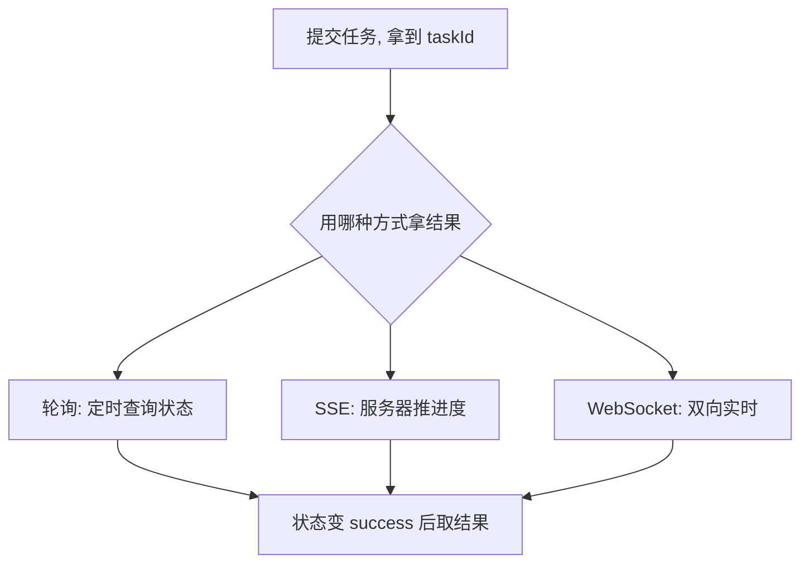

# 异步编程深入

- 03 篇讲了事件循环（同步、微任务、宏任务的执行顺序）。
- 这一篇讲怎么写异步代码：Promise、async / await、fetch、错误处理、取消和并发控制。
- fetch 是浏览器提供的发 HTTP 请求的内置函数，常用来调用后端接口。
- 你的 AIGC 调度工具几乎全是异步：发请求、等结果、轮询、超时、重试、限流，全靠这套东西组织。

- 为什么需要异步：

- 网络请求、定时器、读文件这类操作很慢。
- 如果同步等待，主线程会卡住，页面就会冻结。
- 异步的意思是：先发起任务，不等它完成就继续往下走，等它好了再回来处理结果。

- Promise：

- Promise 是对「一个将来才会有结果的值」的封装，常用来表示网络请求、定时器、文件读取这类异步任务。
- 它有三种状态，且只能从 pending 变一次：
    - pending：进行中。
    - fulfilled：成功，带一个结果值。
    - rejected：失败，带一个错误。
- 拿结果用 `.then`，处理错误用 `.catch`，无论成败都要做的事用 `.finally`。

```js
fetch("/api/models")
  .then((res) => res.json())   // 第一步成功后, 把响应解析成 JSON(JavaScript Object Notation)
  .then((data) => render(data))// 上一步的返回值传到这一步
  .catch((err) => showError(err)) // 链条里任何一步失败都会跳到这里
  .finally(() => hideLoading());  // 不管成败都执行
```

- 关键点：`.then` 会返回新的 Promise，所以可以一直链下去；链条中任意环节抛错，会直接跳到最近的 `.catch`。

- async / await：

- async/await 是 Promise 的语法糖，让异步代码读起来像同步代码。
- `await` 的意思是「在这里等这个 Promise 出结果，再继续」，但它不会阻塞主线程，只是挂起当前函数。
- 错误处理用普通的 try/catch，比 `.catch` 更直观。

```js
async function loadModels() {
  try {
    const res = await fetch("/api/models"); // 等请求回来
    if (!res.ok) {
      // fetch 不会因为 4xx/5xx 自动抛错, 要自己检查
      throw new Error(`请求失败: ${res.status}`);
    }
    const data = await res.json();          // 等解析完成
    return data;
  } catch (err) {
    // 网络错误和上面手动抛的错都会进这里
    showError(err);
    throw err; // 视情况决定是否继续往上抛
  }
}
```

- 一个常被忽略的点：`fetch` 只有在网络层面失败（断网、跨域被拦）才会 reject。服务器返回 404、500 这种「请求成功但结果是错误」，`res.ok` 会是 false，需要你自己判断。

- 串行与并行：

- 多个互不依赖的异步任务，不要一个个 await 串着等，那样总耗时是各任务相加。
- 用 `Promise.all` 同时发起，总耗时约等于最慢的那个。

```js
// 慢: 串行, 总时间 = 三个请求时间之和
const a = await fetchA();
const b = await fetchB();
const c = await fetchC();

// 快: 并行, 总时间 ≈ 最慢的那个
const [a, b, c] = await Promise.all([fetchA(), fetchB(), fetchC()]);
```

- 选择 Promise 系列方法：
    - `Promise.all`：全部成功才成功，有一个失败就整体失败。
    - `Promise.allSettled`：等全部结束，无论成败都返回每个的结果，适合「尽量都跑、单个失败不影响其他」。
    - `Promise.race`：返回最先结束的那个，常用于做超时。

- 超时：

- 网络请求不能无限等，要给它设上限。
- 用 `Promise.race` 让请求和一个定时器赛跑，谁先结束用谁。

```js
function withTimeout(promise, ms) {
  // 一个到时间就 reject 的 Promise
  const timeout = new Promise((_, reject) =>
    setTimeout(() => reject(new Error("超时")), ms)
  );
  // 请求和超时赛跑, 请求慢于 ms 就抛超时错误
  return Promise.race([promise, timeout]);
}

await withTimeout(fetch("/api/slow"), 5000); // 最多等 5 秒
```

- 取消：

- 用户改了参数、关掉了面板，正在飞的请求应该能取消，否则浪费资源还可能用旧结果覆盖新结果。
- 标准做法是 `AbortController`。
- AbortController 是浏览器提供的取消控制器，它会发出一个 signal，fetch 收到 signal 后就能中止请求。

```js
const controller = new AbortController();

fetch("/api/generate", { signal: controller.signal }) // 把信号挂上去
  .then((res) => res.json())
  .catch((err) => {
    if (err.name === "AbortError") return; // 主动取消不算真错误
    showError(err);
  });

// 在需要的时候取消, 比如用户换了参数
controller.abort();
```

- 重试：

- 网络抖动、服务临时不可用，可以自动再试几次。
- 重试之间要加退避（每次等待时间递增），避免瞬间把服务器再打垮。

```js
async function retry(fn, times = 3) {
  for (let i = 0; i < times; i++) {
    try {
      return await fn();           // 成功就直接返回
    } catch (err) {
      if (i === times - 1) throw err; // 最后一次还失败就放弃
      // 退避: 第 1 次等 200ms, 第 2 次 400ms ...
      await new Promise((r) => setTimeout(r, 200 * 2 ** i));
    }
  }
}
```

- 并发限制：

- 调度大量节点时，不能把几百个模型请求同时打出去，会拖垮服务也拖垮自己。
- 思路是维护一个「最多同时跑 N 个」的池子，跑完一个再放进来一个。

```js
async function runWithLimit(tasks, limit) {
  const results = [];
  const running = new Set();

  for (const task of tasks) {
    // 包一层, 完成后把自己从运行集合里移除
    const p = task().then((r) => {
      running.delete(p);
      return r;
    });
    running.add(p);
    results.push(p);

    // 达到上限就等任意一个先跑完, 再继续放新任务
    if (running.size >= limit) {
      await Promise.race(running);
    }
  }
  return Promise.all(results);
}
```

- 等待服务端结果的几种方式：

- 提交任务后拿结果，常见三种模式，和 09 篇的调度对应。
    - 轮询：每隔一段时间问一次「好了吗」，简单但有延迟和无效请求。
    - SSE 是 Server-Sent Events，服务端事件推送，适合进度条、日志流。
    - WebSocket 是浏览器和服务器之间的一条长连接，适合需要前端也频繁发消息的场景。



- 判断异步代码是否靠谱：

- 是否区分了「网络失败」和「服务器返回了错误状态码」。
- 互不依赖的任务是否并行而不是无脑串行。
- 长任务是否有超时，不会无限挂着。
- 用户中途改变意图时，旧请求是否能取消。
- 大批量任务是否有并发上限。
- 错误是否被处理，而不是悄悄吞掉或让整个流程崩掉。
